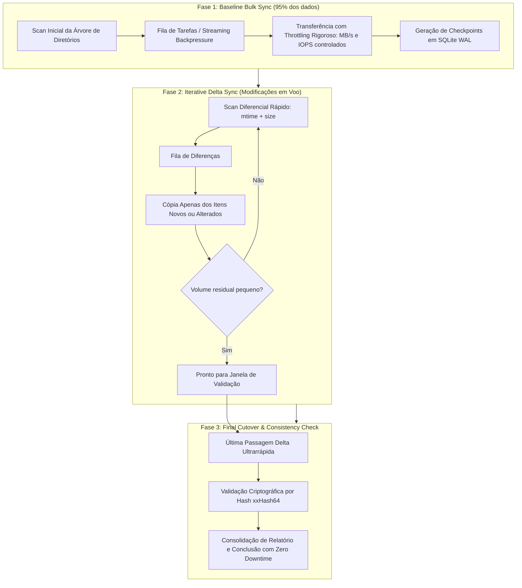
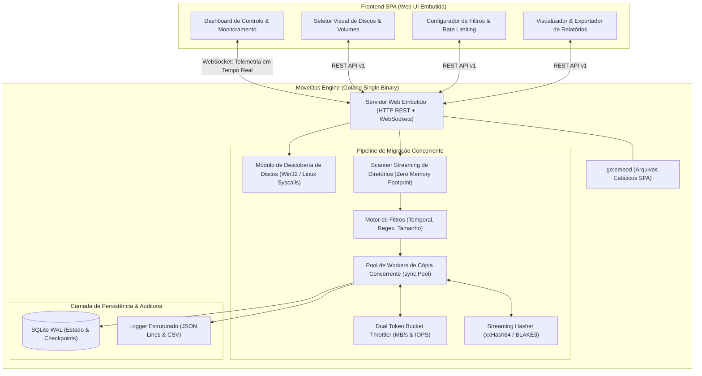

# Arquitetura e Especificação Técnica: MoveOps
## Sistema de Migração Não-Intrusiva de Dados em Larga Escala (100TB+) Cross-Platform

---

## 1. Visão Geral e Requisitos de Negócio

### 1.1 Contexto e Desafio
A migração de grandes volumes de dados corporativos (100TB ou mais, abrangendo dezenas de milhões de arquivos e estruturas profundas de diretórios) frequentemente impõe um dilema crítico às equipes de infraestrutura e engenharia:
- **Impacto em Produção:** Ferramentas tradicionais de cópia (como `rsync`, `robocopy` ou scripts ad-hoc) saturam barramentos de I/O, canais SAN/NAS e filas de controladoras de disco, provocando aumento inaceitável de latência (*I/O wait*) e indisponibilidade para os serviços em produção que leem e escrevem continuamente nos discos.
- **Downtime Inviável:** Parar operações corporativas para sincronização a frio de 100TB é inviável, pois a uma taxa de 200 MB/s, uma cópia integral consome mais de 5 a 6 dias contínuos.
- **Heterogeneidade de Ambientes:** Operações exigem migrações locais e em rede entre servidores **Linux** e **Windows** (Linux para Linux, Windows para Windows, Linux para Windows e Windows para Linux), enfrentando disparidades de sistemas de arquivos (ext4/XFS vs. NTFS/ReFS), permissões, metadados e limites de caminhos (`MAX_PATH`).
- **Necessidade de Operabilidade Visual e Auditoria:** Operadores de TI, DBAs e administradores de armazenamento necessitam de uma interface visual simples, amigável e interativa, dispensando a memorização de parâmetros complexos de linha de comando, com auditoria forense ponta a ponta.

### 1.2 Objetivos Centrais do Projeto
O **MoveOps** foi concebido como uma solução de nível empresarial para migração granular, progressiva e estritamente controlada de dados, operando sob os seguintes pilares:
1. **Zero Downtime Operacional:** Clientes e aplicações de produção continuam efetuando operações de leitura e escrita no disco/volume de origem sem degradação perceptível.
2. **Rate Limiting Granular e Adaptativo:** Controle estrito de taxa de transferência (MB/s) e operações de I/O por segundo (IOPS), ajustáveis em tempo de execução sem interrupção do processo.
3. **Multi-Pass Sync com Detecção Inteligente de Deltas:** Estratégia em fases que reduz a janela de sincronização final a um intervalo residual mínimo.
4. **Descoberta Nativa Cross-Platform de Discos:** Detecção automática e exibição de todos os discos, partições, pontos de montagem e volumes em Linux e Windows.
5. **Filtros Parametrizáveis:** Migração completa, espelhamento diferencial (*delta only*), ou particionamento granular por data de modificação (ano, mês, dia ou intervalos customizados).
6. **Auditoria Rigorosa e Checkpoint Transacional:** Rastreabilidade por arquivo com hashes de integridade progressivos, geração de logs estruturados (JSON/CSV), relatórios sumarizados e capacidade de retomada imediata (*resume*) pós-falha.
7. **Binário Único Autocontido com Dashboard Web:** Uma aplicação compilada sem dependências externas, que embute um frontend web responsivo moderno, servido nativamente via HTTP e WebSocket.

---

## 2. Requisitos de Sistema

### 2.1 Requisitos Funcionais (RF)
| ID | Requisito Funcional | Descrição |
| :--- | :--- | :--- |
| **RF-01** | **Descoberta de Discos e Volumes** | Identificar e listar dinamicamente discos físicos, partições lógicas, pontos de montagem, volumes de rede (UNC/NFS/CIFS), sistemas de arquivos, espaço total e livre no host local (Linux e Windows). |
| **RF-02** | **Seleção de Origem e Destino** | Permitir a seleção visual ou via caminho de qualquer diretório, disco ou volume de origem e destino, validando permissões de leitura na origem e escrita no destino antes do início. |
| **RF-03** | **Migração Multi-Pass com Delta Sync** | Executar migração em múltiplas passagens: cópia base (baseline) seguida de passagens incrementais (delta) apenas com itens criados ou alterados durante a execução anterior. |
| **RF-04** | **Throttling Parametrizável (Banda e IOPS)** | Possibilitar a configuração de limites máximos de transferência em MB/s e IOPS máximos para leitura e escrita, ajustáveis a quente via painel web. |
| **RF-05** | **Filtros Granulares de Data e Tempo** | Permitir ao operador filtrar arquivos por: (a) Migração Completa; (b) Por dia, mês ou ano específico; (c) Por intervalo de datas `[Data Inicial, Data Final]`; (d) Por idade relativa (ex: arquivos com mais de X meses). |
| **RF-06** | **Filtros de Padrão e Metadados** | Incluir/excluir arquivos com base em expressões glob, regex, tamanho mínimo/máximo e extensões ignoradas (ex: arquivos temporários, logs transientes). |
| **RF-07** | **Verificação Criptográfica de Integridade** | Calcular somas de verificação progressivas durante o fluxo de I/O (via xxHash64 ou BLAKE3) garantindo equivalência exata entre origem e destino sem custo de dupla leitura. |
| **RF-08** | **Preservação de Metadados e Atributos** | Preservar timestamps de modificação (`mtime`), acesso (`atime`), permissões compatíveis e atributos de arquivo entre os sistemas de arquivos. |
| **RF-09** | **Checkpointing e Tolerância a Falhas** | Gravar estado transacional de cada arquivo transferido em base leve local (SQLite WAL); caso haja reinicialização do servidor ou queda de conexão, o processo retoma exatamente de onde parou. |
| **RF-10** | **Auditoria e Relatórios Executivos** | Gerar log estruturado linha a linha em JSON Lines (`audit.jsonl`) e CSV com status de cada arquivo, além de relatório consolidado (PDF/HTML) com métricas de performance. |
| **RF-11** | **Painel Web Interativo Integrado** | Disponibilizar interface web intuitiva para monitoramento de progresso em tempo real (taxa atual de MB/s, IOPS, arquivos restantes, percentual concluído e logs em streaming). |

### 2.2 Requisitos Não-Funcionais (RNF)
| ID | Requisito Não-Funcional | Descrição |
| :--- | :--- | :--- |
| **RNF-01** | **Pegada de Memória Limitada (Bounded Memory)** | O consumo de memória RAM do processo não deve crescer linearmente com o número de arquivos ($O(1)$ em relação ao inventário global). Estrutura de streaming de metadados com backpressure, mantendo uso típico de memória $< 150 \text{ MB}$ mesmo para 50 milhões de arquivos. |
| **RNF-02** | **Não-Intrusividade na Produção** | O impacto na latência de leitura/escrita do disco de origem deve ser mantido abaixo de $5\%$ em relação à linha de base de produção, utilizando priorização de I/O em nível de SO (`ionice`/`IOPRIO_CLASS_IDLE` em Linux e `PROCESS_MODE_BACKGROUND_BEGIN` em Windows). |
| **RNF-03** | **Portabilidade Estática sem Dependências** | Binário único autônomo, compilado de forma 100% estática (`CGO_ENABLED=0`), executável sem instalação prévia de interpretadores, runtimes (.NET, Java, Python, Node) ou bibliotecas dinâmicas externas. |
| **RNF-04** | **Suporte a Nomes de Arquivo Longos** | Suportar caminhos com mais de 260 caracteres no Windows utilizando prefixos estendidos de sistema de arquivos (`\\?\` e `\\?\UNC\`). |
| **RNF-05** | **Alta Eficiência de CPU** | O algoritmo de hash e a compressão/cópia não devem saturar a CPU do host; o hashing deve operar a velocidades superiores a $5\text{ GB/s}$ por núcleo físico. |
| **RNF-06** | **Telemetria de Baixa Latência** | As métricas de transferência no painel web devem ser atualizadas via WebSocket com latência inferior a $500\text{ ms}$. |

---

## 3. Seleção de Tecnologia & Justificativa Técnica: Go vs. Rust

Para uma aplicação cujo núcleo é transferência intensiva de arquivos em sistemas operacionais distintos, avaliou-se exaustivamente duas candidatas de elite: **Go (Golang)** e **Rust**.

### 3.1 Matriz Comparativa Técnica

```
+-----------------------------------+-----------------------------------+-----------------------------------+
| Critério de Arquitetura           | Go (Golang 1.22+)                 | Rust (Edição 2021)                |
+-----------------------------------+-----------------------------------+-----------------------------------+
| Throughput de I/O e Saturação     | Excelente. O I/O de disco é       | Máximo teórico. Controle absoluto |
| de Barramento                     | limitado pelo hardware, buffers   | de alocação de página e chamadas  |
|                                   | de kernel e barramento PCI-e/SAN. | diretas de baixo nível de I/O.    |
+-----------------------------------+-----------------------------------+-----------------------------------+
| Concorrência e Pipeline           | Goroutines leves (2KB) com canais | Async/Await com Tokio/Mio ou      |
| de Processamento                  | e runtime M:N. Modelo simples,    | Rayon. Muito performático, porém  |
|                                   | resiliente e à prova de deadlocks | curva de borrow checker complexa  |
|                                   | em pipelines de workers.          | em estruturas cíclicas de estado. |
+-----------------------------------+-----------------------------------+-----------------------------------+
| Gerenciamento de Memória & GC     | GC concorrente sub-milissegundo   | Zero GC. Alocação estática e      |
| Overhead                          | (<1ms pausa). Com sync.Pool para  | RAII. Zero overhead de pausa.     |
|                                   | buffers de transferência, o       | Ideal para micro-latências        |
|                                   | GC permanece praticamente ocioso. | extremas de sub-microssegundos.   |
+-----------------------------------+-----------------------------------+-----------------------------------+
| Cross-Compilation Cruzada         | Imbatível. CGO_ENABLED=0 permite  | Mais trabalhosa. Compilar para    |
| (Linux <-> Windows)               | compilar nativamente de Linux     | Windows a partir do Linux exige   |
|                                   | para Windows (ou vice-versa) em   | toolchains cruzadas completas     |
|                                   | segundos sem toolchains externas. | (MinGW, musl-tools, etc.).        |
+-----------------------------------+-----------------------------------+-----------------------------------+
| Embutimento de Frontend (SPA)     | Suporte nativo pelo compilador    | Requer crates externos como       |
| em Binário Único                  | através da diretiva embed.FS      | rust-embed ou include_dir!, com   |
|                                   | sem necessidade de dependências.  | maior fricção em build scripts.   |
+-----------------------------------+-----------------------------------+-----------------------------------+
| Manipulação de Syscalls e APIs    | Nativa e madura via pacotes       | Excelente via crates winapi,      |
| Nativas (Win32 / Unix)            | golang.org/x/sys/windows e        | windows-sys e nix, porém com      |
|                                   | golang.org/x/sys/unix.            | maior verbosidade e unsafe blocks.|
+-----------------------------------+-----------------------------------+-----------------------------------+
| Tempo de Compilação & Agilidade   | Compilação ultra-rápida (poucos   | Compilação consideravelmente mais |
| de Manutenção Corporativa         | segundos), curva de manutenção    | lenta, exigência de maior tempo   |
|                                   | linear e excelente legibilidade.  | de desenvolvimento e onboarding.  |
+-----------------------------------+-----------------------------------+-----------------------------------+
```

### 3.2 Veredito e Escolha Arquitetural: **Golang**
A linguagem recomendada e eleita para o projeto é **Go (Golang)**, fundamentada pelos seguintes fatos técnicos:
1. **O Gargalo é I/O, não Ciclos de CPU:** Em migrações de dados de 100TB reguladas por *rate limiting* e latência de disco, a diferença de nanossegundos entre Go e Rust é irrelevante frente ao tempo de espera de cabeçotes mecânicos ou filas NVMe/SAN. O throughput de leitura/escrita em Go atinge a velocidade máxima do barramento físico da máquina.
2. **Eliminação de GC Overhead via Alocação Zero:** Utilizando `sync.Pool` para reciclar buffers circulares de leitura/escrita (ex: blocos de 1MB a 4MB), o motor do MoveOps não gera lixo no heap durante a cópia contínua de arquivos, neutralizando por completo qualquer impacto do *Garbage Collector*.
3. **Distribuição e Portabilidade Enterprise:** Go gera binários estáticos autocontidos para Linux (`ELF 64-bit`) e Windows (`PE 64-bit .exe`) com zero dependências de C runtime (Glibc ou MSVCRT). O operador pode copiar um arquivo executável único para qualquer servidor e executá-lo imediatamente.
4. **Embutimento de Interface Web Nativa:** Com a diretiva `go:embed`, toda a interface web compilada (HTML5, JavaScript empacotado, CSS Tailwind e ativos visuais) reside internamente dentro do binário Go. Ao iniciar o binário, ele automaticamente sobe um servidor HTTP e abre o painel para o operador.

---

## 4. Estratégia de Migração Não-Intrusiva (Zero Downtime em 100TB+)

### 4.1 O Desafio do Zero Downtime com Carga Ativa
Durante a transferência de um repositório de 100TB, os clientes de produção continuam criando novos arquivos, atualizando conteúdos existentes e excluindo registros obsoletos. Para garantir integridade estrita sem demandar interrupção de serviço, o MoveOps emprega a metodologia **Multi-Pass Sync (Sincronização Progressiva em Múltiplas Etapas)**.



#### Detalhamento das Etapas:
1. **Fase 1 — Baseline Bulk Sync (Cópia Base Inicial):**
   - Transfere a totalidade do repositório em segundo plano com restrição estrita de recursos (*background priority*).
   - O tráfego de produção não é afetado, pois o *Rate Limiter* restringe a velocidade da cópia a uma fração controlada da capacidade do link (ex: 40% da banda ociosa).
   - Conforme cada arquivo é copiado com sucesso, um registro atômico com seu hash e timestamp é gravado no banco de checkpoints.
2. **Fase 2 — Iterative Delta Sync (Sincronizações Incrementais em Voo):**
   - Ao término da Fase 1 (que pode levar dias em grandes volumes), diversos arquivos foram criados ou editados no disco de origem pela produção.
   - O MoveOps executa varreduras diferenciais rápidas na árvore, detectando arquivos cujo `mtime` (data de modificação) ou `size` (tamanho) diferem da origem ou do checkpoint registrado.
   - Apenas esses arquivos são transferidos. Essa passagem dura uma fração do tempo da primeira. O ciclo pode ser repetido em 2 ou 3 iterações até que a lista de pendências seja mínima.
3. **Fase 3 — Final Cutover & Validação de Consistência:**
   - Com o volume de discrepâncias reduzido a um residual desprezível, uma passagem final ultrarrápida é executada.
   - Para volumes que exigem virada de apontamento definitiva de aplicações, o tempo de reconciliação final dura apenas alguns segundos, permitindo a transição com zero indisponibilidade percebida.

---

### 4.2 Algoritmo de Rate Limiting Adaptativo (Dual Token Bucket)

Para proteger discos mecânicos (HDD) de saturação de cabeçotes por excesso de concorrência e arrays flash/NVMe/SAN de esgotamento de banda, o motor do MoveOps adota um modelo **Dual Token Bucket** desacoplado, regulando tanto o volume de dados (Bytes/segundo) quanto o número de operações elementares (IOPS).

```
   Configuração Dinâmica (via Web UI / API)
         |                             |
         v                             v
  +--------------+              +--------------+
  |  Byte Token  |              |  IOPS Token  |
  |    Bucket    |              |    Bucket    |
  |  (Cap: MB/s) |              |  (Cap: IOPS) |
  +-------+------+              +-------+------+
          |                             |
          +--------------+--------------+
                         |
                         v
                [ Gatekeeper de I/O ]
           Aguarda liberação de ambos os
             tokens antes de executar
                         |
                         v
            [ Leitura/Escrita no Disco ]
```

#### Modelo Matemático do Token Bucket
Para um limite de largura de banda $R_{bytes}$ (bytes/s) com capacidade máxima de rajada (*burst*) $B_{bytes}$, e um limite de operações $R_{iops}$ com capacidade $B_{iops}$:
- A cada instante de tempo $t$, o volume de tokens de bytes disponíveis $T_b(t)$ é atualizado por:
  $$T_b(t) = \min(B_{bytes}, T_b(t_{prev}) + R_{bytes} \cdot (t - t_{prev}))$$
- Similarmente, os tokens de operações $T_{iops}(t)$ são atualizados por:
  $$T_i(t) = \min(B_{iops}, T_i(t_{prev}) + R_{iops} \cdot (t - t_{prev}))$$
- **Consumo:** Antes de ler ou escrever um bloco de $S$ bytes, a goroutine do worker solicita $S$ tokens de bytes e $1$ token de operação ao Gatekeeper. Se houver déficit de tokens, o worker entra em *sleep cooperativo* via timer de alta precisão do runtime Go, sem queimar CPU em *busy waiting*.

#### Ajuste Dinâmico em Tempo Real (*Hot Reloading*)
Os limites $R_{bytes}$ e $R_{iops}$ residem em ponteiros atômicos (`atomic.Pointer` ou canais sincronizados). O operador pode alterar a velocidade máxima de 50 MB/s para 200 MB/s pela interface web durante a madrugada e reduzi-la para 30 MB/s no início do expediente sem necessidade de pausar ou reiniciar a migração.

#### Priorização no Sistema Operacional
- **Linux:** Aplicação de `unix.IoprioSet` com classe `IOPRIO_CLASS_IDLE` ou `IOPRIO_CLASS_BE` (Best Effort com prioridade mínima), assegurando que o escalonador de I/O do kernel (CFQ, BFQ, Kyber) conceda preferência absoluta a processos de produção concorrentes.
- **Windows:** Invocação de `SetPriorityClass` com `PROCESS_MODE_BACKGROUND_BEGIN` para colocar threads de I/O do processo em prioridade de background, reduzindo impacto no subsistema de armazenamento.

---

### 4.3 Detecção de Alterações e Verificação de Integridade (Hashing Progressivo)

Para alcançar alta velocidade sem comprometer a confiabilidade, a verificação adota uma estratégia escalonada em 3 níveis:

```
[ Arquivo Detectado ]
         |
         v
+--------------------------------------------------------+
| Nível 1: Verificação Rápida de Metadados               |
| - Compara Size (tamanho em bytes)                      |
| - Compara mtime (timestamp com precisão em nanosseg)   |
+--------------------------------------------------------+
         |
         +--> Se Size e mtime idênticos ao destino/checkpoint:
         |    [ Arquivo Inalterado -> SKIP instantâneo ]
         |
         +--> Se metadados divergentes ou arquivo ausente:
              |
              v
+--------------------------------------------------------+
| Nível 2: Cópia e Streaming Hashing Progressivo         |
| - Leitura em chunks (ex: 1MB a 4MB) do disco de origem |
| - Alimentação concorrente da hash engine: xxHash64     |
| - Escrita no disco de destino com rate limit aplicado  |
| - Alimentação concorrente da hash engine do destino    |
+--------------------------------------------------------+
              |
              v
+--------------------------------------------------------+
| Nível 3: Confirmação Atômica e Atualização de Metadados|
| - Compara Hash Origem == Hash Destino                  |
| - Se match: Preserva mtime/atime via os.Chtimes        |
| - Registra checkpoint seguro no SQLite WAL             |
| - Se mismatch: Reporta erro, apaga destino, agenda     |
|   tentativa de retry com backoff exponencial           |
+--------------------------------------------------------+
```

#### Por que xxHash64 / BLAKE3 em vez de MD5 ou SHA-256?
- Algoritmos tradicionais como SHA-256 operam em torno de 350 a 450 MB/s por núcleo de CPU. Em discos NVMe modernos que leem a 3.000 MB/s, o cálculo de SHA-256 torna-se o gargalo primário, saturando múltiplos núcleos de CPU desnecessariamente.
- O **xxHash64** atinge taxas superiores a **10 GB/s por núcleo**, superando com folga o teto de barramento de qualquer subsistema de armazenamento atual com taxa de colisão matematicamente insignificante para integridade de arquivos.
- **Streaming Inline Hash:** O hash do arquivo de origem é calculado simultaneamente enquanto os blocos trafegam pelo buffer de memória em direção ao arquivo de destino. O sistema nunca precisa reler o arquivo do disco após a cópia para verificar sua integridade, poupando 50% de I/O do disco.

---

## 5. Engenharia Cross-Platform de Sistema de Arquivos (Linux & Windows)

### 5.1 Descoberta Automática de Discos e Volumes

O subsistema de descoberta de armazenamento abstrai as particularidades de cada sistema operacional, retornando uma estrutura padronizada para o backend e frontend:

```go
type DiskVolume struct {
    ID           string   `json:"id"`            // Ex: "C:" ou "/dev/sdb1"
    MountPoint   string   `json:"mount_point"`   // Ex: "C:\" ou "/mnt/data"
    Label        string   `json:"label"`         // Ex: "Volume Produção"
    FileSystem   string   `json:"filesystem"`    // Ex: "NTFS", "ext4", "xfs", "NFS"
    TotalBytes   uint64   `json:"total_bytes"`   // Capacidade total
    FreeBytes    uint64   `json:"free_bytes"`    // Espaço livre
    UsedBytes    uint64   `json:"used_bytes"`    // Espaço utilizado
    IsRotational bool     `json:"is_rotational"` // True para HDD mecânico, False para SSD/NVMe
    IsReadOnly   bool     `json:"is_read_only"`  // Flag de proteção contra escrita
}
```

#### Implementação Nativa em Linux:
1. **Identificação de Pontos de Montagem:** Leitura e parsing direto de `/proc/mounts` e `/etc/mtab`.
2. **Capacidade e Utilização:** Syscall nativa `unix.Statfs` (extraindo `Bsize`, `Blocks`, `Bfree`, `Bavail`).
3. **Tipo de Mídia (Rotacional vs. Flash):** Leitura do pseudoterminal `/sys/block/<device>/queue/rotational` (valor `1` indica disco rígido rotacional mecânico, `0` indica SSD ou NVMe).
4. **Volumes de Rede:** Reconhecimento de sistemas montados dos tipos `nfs`, `cifs`, `smbfs`, `glusterfs`.

#### Implementação Nativa em Windows:
1. **Enumeração de Letras de Unidade:** Chamada à Win32 API `GetLogicalDrives()` para obter a bitmask de unidades ativas (A: a Z:).
2. **Tipos de Dispositivo:** Chamada a `GetDriveTypeW(driveRoot)` para classificar volumes em `DRIVE_FIXED`, `DRIVE_REMOTE` (mapeamentos de rede SMB/CIFS), `DRIVE_REMOVABLE` ou `DRIVE_CDROM`.
3. **Espaço e Quotas:** Chamada a `GetDiskFreeSpaceExW(driveRoot, &freeBytesAvailable, &totalBytes, &totalFreeBytes)` para obter medições precisas de capacidade considerando eventuais cotas de usuário.
4. **Identificação de Volume:** Chamada a `GetVolumeInformationW(driveRoot, ...)` para extrair o rótulo do volume (*Volume Name*) e o sistema de arquivos (*NTFS*, *ReFS*, *FAT32*).
5. **Pontos de Montagem em Pastas:** Enumeração de GUIDs de volumes via `FindFirstVolumeW` / `FindNextVolumeW` para suportar volumes montados como diretórios sem letra atribuída.

---

### 5.2 Normalização de Caminhos e Suporte a Extended-Length Paths

Para garantir interoperabilidade e robustez entre Linux e Windows:
1. **Windows Extended-Length Path (`\\?\`):**
   - O Windows possui uma limitação histórica de comprimento de caminho (`MAX_PATH = 260` caracteres).
   - O MoveOps prefixa automaticamente todos os caminhos absolutos locais com `\\?\` (ex: `\\?\C:\DiretorioMuitoLongo\...`) e caminhos de rede UNC com `\\?\UNC\servidor\compartilhamento\...`, elevando o limite para **32.767 caracteres Unicode**.
2. **Normalização de Separadores:**
   - Tratamento universal interno de caminhos em formato canônico (`/`), convertendo para separador nativo do sistema operacional (`\` no Windows, `/` no Linux) no momento exato do acesso à syscall.
3. **Tratamento de Caracteres Reservados em Migrações Linux -> Windows:**
   - O Linux permite nomes contendo caracteres que o Windows proíbe terminantemente: `\ / : * ? " < > |` e nomes reservados (`CON`, `PRN`, `AUX`, `NUL`, `COM1` a `COM9`, `LPT1` a `LPT9`).
   - O MoveOps implementa uma tabela de escape/sanitização configurável na UI (ex: substituição de `:` por `_` ou codificação percentual segura), registrando o mapeamento original no log de auditoria para integridade bidirecional.
4. **Preservação de Atributos e Permissões:**
   - Preservação temporal rigorosa via `os.Chtimes(path, atime, mtime)` com granularidade de nanossegundos.
   - Em Linux: replicação de `POSIX mode bits` (`os.Chmod`) e preservação de UID/GID quando executado como `root`.
   - Em Windows: preservação de atributos de arquivo (`FILE_ATTRIBUTE_READONLY`, `FILE_ATTRIBUTE_HIDDEN`, `FILE_ATTRIBUTE_SYSTEM`) via `SetFileAttributesW`.

---

## 6. Filtros Parametrizáveis e Modos de Migração

O sistema disponibiliza aos operadores opções de filtragem granular para atender a múltiplos cenários de negócio (migração integral de infraestrutura, expurgo com arquivamento histórico por ano, ou sincronização rápida de deltas).

```
+---------------------------------------------------------------------------------------+
|                                    MODOS DE EXECUÇÃO                                  |
+---------------------------------------------------------------------------------------+
|  [1] FULL MIGRATION       | Espelhamento completo de toda a árvore de diretórios.     |
|  [2] GRANULAR POR DATA    | Seleção restrita por faixa temporal de modificação:       |
|                           |   - Por Ano específico (ex: apenas arquivos de 2024)      |
|                           |   - Por Mês/Ano (ex: arquivos de 03/2025)                 |
|                           |   - Por Dia específico (ex: arquivos de 15/09/2026)       |
|                           |   - Por Intervalo [Data Início - Data Fim]                |
|                           |   - Por Idade Relativa (ex: mais antigos que 365 dias)    |
|  [3] DELTA ONLY           | Apenas arquivos novos ou que sofreram alterações.         |
+---------------------------------------------------------------------------------------+
|                                  FILTROS DE PADRÃO E METADADOS                        |
+---------------------------------------------------------------------------------------+
|  Include Patterns:        | Glob/Regex permitidos (ex: *.pdf, *.docx, *.dcm)          |
|  Exclude Patterns:        | Glob/Regex ignorados (ex: *.tmp, ~*, node_modules/, .git/)|
|  Faixa de Tamanho:        | MinSizeBytes (ex: >= 1 KB) e MaxSizeBytes (ex: <= 50 GB)  |
|  Preservar Exclusões:     | Safe Copy (não apaga órfãos) vs. Mirror (apaga órfãos)    |
+---------------------------------------------------------------------------------------+
```

### 6.1 Detalhamento dos Filtros Granulares de Data
A avaliação temporal é executada durante o scanner inicial de metadados (`FileInfo.ModTime()`), evitando leitura desnecessária do corpo de arquivos fora do critério:
- **Filtro por Ano:** `mtime.Year() == TargetYear`
- **Filtro por Mês/Ano:** `mtime.Year() == TargetYear && mtime.Month() == TargetMonth`
- **Filtro por Dia:** `mtime.Truncate(24h) == TargetDate.Truncate(24h)`
- **Filtro por Intervalo:** `mtime >= StartTime && mtime <= EndTime`
- **Filtro por Idade:** `time.Since(mtime) > RetentionPeriod`

---

## 7. Sistema de Auditoria, Checkpointing e Relatórios

### 7.1 Resiliência com Checkpointing Local (SQLite WAL)
Para suportar migrações seguras de 100TB que podem levar dias, o MoveOps mantém um banco de dados relacional embarcado local (SQLite operando no modo de alta concorrência **WAL - Write-Ahead Logging**) ou base chave-valor rápida.
- Cada arquivo processado é marcado atômica e transacionalmente como: `PENDING`, `IN_PROGRESS`, `COMPLETED`, `SKIPPED`, ou `FAILED`.
- Em caso de falha de energia do servidor, parada manual do operador ou desconexão transitória de rede, o sistema ao ser reiniciado efetua *Resume* instantâneo: lê o estado do banco e recomeça a transferência exatamente do ponto interrompido sem reprocessar arquivos já verificados.

### 7.2 Log Estruturado de Auditoria (JSON Lines e CSV)
Cada evento de arquivo concluído gera uma entrada em tempo real no arquivo de log estruturado `audit_events.jsonl` e no consolidado `audit_report.csv`.

#### Especificação do Esquema de Dados do Evento de Auditoria:
```json
{
  "event_id": "evt-9a8f4c21",
  "job_id": "job-migration-nas-01",
  "timestamp": "2026-10-06T01:15:30.124Z",
  "action": "COPIED",
  "source_path": "/mnt/storage/contratos/2025/doc_8492.pdf",
  "dest_path": "/mnt/backup/contratos/2025/doc_8492.pdf",
  "size_bytes": 14680064,
  "duration_ms": 234,
  "throughput_mbs": 62.73,
  "source_hash_xx64": "e3b0c44298fc1c14",
  "dest_hash_xx64": "e3b0c44298fc1c14",
  "source_mtime": "2025-05-12T14:22:00Z",
  "dest_mtime": "2025-05-12T14:22:00Z",
  "retries": 0,
  "status": "SUCCESS",
  "error_message": null
}
```

### 7.3 Relatório Sumarizado Executivo
Ao término ou pausa do trabalho, o MoveOps consolida métricas agregadas em um documento executivo para assinatura de conformidade técnica e auditoria:
- **Resumo de Volumetria:**
  - Total de arquivos examinados vs. copiados vs. ignorados (*skipped*) vs. falhas definitivas.
  - Total de bytes planejados vs. transferidos.
- **Resumo de Performance:**
  - Duração total do trabalho (tempo ativo de transferência vs. tempo ocioso/pausado).
  - Taxa média e taxa de pico de transferência (MB/s).
  - Média de IOPS sustentado durante a janela.
- **Relatório de Discrepâncias:**
  - Lista completa de arquivos com falha e respectiva causa raiz (ex: erro de permissão `EACCES`, bloqueio exclusivo por outro processo em Windows `ERROR_SHARING_VIOLATION`, arquivo corrompido na leitura de origem).
  - Sugestões automatizadas de remediação.

---

## 8. Arquitetura da Solução & Contratos de Software

### 8.1 Visão Geral dos Componentes e Fluxo de Dados



---

### 8.2 Especificação dos Contratos de API REST e WebSocket

#### Endpoints da API REST (`/api/v1`)
1. **Descoberta de Discos do Sistema:**
   - `GET /api/v1/disks`
   - Retorna a lista completa de discos físicos, partições, volumes e espaço disponível detectados no host.
2. **Navegação de Pastas / Validação de Acesso:**
   - `POST /api/v1/browse`
   - Body: `{"path": "/mnt/data", "operation": "read"}`
   - Permite ao operador inspecionar diretórios e validar antecipadamente se o processo possui privilégios de leitura e escrita.
3. **Pré-visualização da Migração (Dry-Run / Estimation):**
   - `POST /api/v1/migration/preview`
   - Body: Parâmetros de origem, destino e filtros.
   - Retorna a contagem estimada de arquivos elegíveis, volume total em GB e estimativa de tempo baseada no rate limit.
4. **Gerenciamento do Ciclo de Vida da Migração:**
   - `POST /api/v1/migration/start` — Inicia novo job de migração.
   - `POST /api/v1/migration/pause` — Pausa graciosamente a transferência sem perda de estado.
   - `POST /api/v1/migration/resume` — Retoma a transferência de onde parou.
   - `POST /api/v1/migration/stop` — Cancela o job atual de forma segura, fechando arquivos abertos.
5. **Ajuste Dinâmico de Throttling em Tempo de Execução:**
   - `PATCH /api/v1/migration/rate-limit`
   - Body: `{"max_bandwidth_mb": 150, "max_iops": 500}`
   - Aplicação instantânea sem reiniciar a migração.
6. **Auditoria e Relatórios:**
   - `GET /api/v1/reports/summary?job_id=xxx` — Retorna dados consolidados para exibição e geração de PDF.
   - `GET /api/v1/reports/export?format=csv` — Download do arquivo CSV de auditoria.

#### Streaming de Telemetria via WebSocket (`/api/v1/ws`)
O canal WebSocket emite pacotes JSON a cada **500ms** contendo o estado operacional do pipeline:
```json
{
  "type": "METRICS_UPDATE",
  "payload": {
    "job_id": "job-migration-nas-01",
    "status": "RUNNING",
    "current_phase": "PHASE_1_BASELINE",
    "current_throughput_mbs": 84.32,
    "current_iops": 412,
    "limit_bandwidth_mb": 100.0,
    "limit_iops": 500,
    "total_files_discovered": 8420950,
    "files_copied": 3120440,
    "files_skipped": 5200100,
    "files_failed": 12,
    "total_bytes_discovered": 109951162777600,
    "bytes_transferred": 35184372088832,
    "progress_percent": 32.0,
    "active_workers": 8,
    "current_file": "vol1/data/empresa/relatorios_fiscais_2024.zip",
    "elapsed_seconds": 415200,
    "eta_seconds": 880400
  }
}
```

---

### 8.3 Design do Dashboard Frontend

O frontend será projetado como uma **Single Page Application (SPA)** leve e moderna utilizando **React**, **Vite**, **Tailwind CSS** e ícones **Lucide**, embutida no binário Go.

```
+-----------------------------------------------------------------------------------------------+
|  MoveOps  [v1.0.0]        Status: EM EXECUÇÃO [Fase 1]        Host: srv-storage-01 |
+-----------------------------------------------------------------------------------------------+
|                                                                                               |
|  [ SELEÇÃO DE VOLUMES E DISCOS ]                                                             |
|  +--------------------------------------------+    +----------------------------------------+ |
|  | DISCO ORIGEM:                              |    | DISCO DESTINO:                         | |
|  | [ C:\ Dados Produção (NTFS) - 120TB ] [v]  | -> | [ E:\ Repositório Migrado - 150TB ] [v]| |
|  | Usado: 98TB / 120TB (81%) | HDD Rotacional |    | Livre: 148TB / 150TB | NVMe Storage    | |
|  +--------------------------------------------+    +----------------------------------------+ |
|                                                                                               |
|  [ FILTROS & REGRAS DE MIGRAÇÃO ]                                                             |
|  ( ) Cópia Completa (Full)   (*) Granular por Data   ( ) Delta Sync (Apenas Modificados)      |
|  Data Inicial: [ 2025-01-01 ]  Data Final: [ 2026-10-01 ]  [X] Filtrar por data de modificação|
|  Extensões Excluídas: [ *.tmp, ~*.*, *.bak ]               Tamanho Mínimo: [ 0 KB ]           |
|                                                                                               |
|  [ CONTROLE DE VAZÃO DINÂMICO (RATE LIMITING) ]                                               |
|  Largura de Banda: [====|----------------] 80 MB/s (Ajustável em tempo real)                  |
|  Limite de IOPS:   [=======|-------------] 450 IOPS (Proteção do disco de produção)           |
|                                                                                               |
|  +-----------------------------------------------------------------------------------------+  |
|  | TELEMETRIA & PROGRESSO EM TEMPO REAL                                                    |  |
|  | Progresso Global: [=======================>-----------------------] 48.2%              |  |
|  | Taxa Atual: 78.4 MB/s | IOPS: 398 | Arquivos: 4.120.000 / 8.540.000 | Erros: 0         |  |
|  | Arquivo Atual: /mnt/dados/financeiro/contas_receber_2025.db                             |  |
|  +-----------------------------------------------------------------------------------------+  |
|                                                                                               |
|  [ AÇÕES ]                                                                                    |
|  [ INICIAR MIGRAÇÃO ]     [ PAUSAR ]     [ AJUSTAR LIMITES ]     [ EXPORTAR AUDITORIA (CSV) ] |
+-----------------------------------------------------------------------------------------------+
```

---

### 8.4 Estrutura de Diretórios Recomendada do Projeto

```
migrations/
├── ARCHITECTURE.md                  # Especificação arquitetural do sistema (este documento)
├── README.md                        # Guia de compilação, implantação e operação
├── go.mod                           # Módulo Go principal
├── go.sum                           # Checksums de dependências Go
├── Makefile                         # Scripts de automação de build cross-platform
│
├── cmd/
│   └── hypersync/
│       └── main.go                  # Ponto de entrada do executável e inicialização dos serviços
│
├── internal/
│   ├── api/
│   │   ├── handler.go               # Handlers REST da API
│   │   ├── router.go                # Roteamento de rotas e middlewares
│   │   └── websocket.go             # Hub de WebSockets e streaming de métricas
│   │
│   ├── audit/
│   │   ├── checkpoint.go            # Gerenciador de checkpoints transacionais (SQLite WAL)
│   │   ├── logger.go                # Gerador de logs estruturados (JSON Lines / CSV)
│   │   └── report.go                # Consolidador e gerador de relatórios sumarizados
│   │
│   ├── discovery/
│   │   ├── disk.go                  # Interface genérica de descoberta de discos
│   │   ├── disk_linux.go            # Implementação Linux (/proc/mounts, /sys/block, statfs)
│   │   └── disk_windows.go          # Implementação Windows (GetLogicalDrives, Win32 APIs)
│   │
│   ├── engine/
│   │   ├── coordinator.go           # Orquestrador do ciclo Multi-Pass (Fases 1, 2 e 3)
│   │   ├── filter.go                # Mecanismo de filtros (data, regex, tamanho)
│   │   ├── hasher.go                # Streaming hash progressivo (xxHash64 / BLAKE3)
│   │   ├── pipeline.go              # Pool de workers e gerenciamento de buffers (sync.Pool)
│   │   ├── ratelimiter.go           # Algoritmo Dual Token Bucket (MB/s & IOPS)
│   │   └── scanner.go               # Scanner de diretórios em streaming com backpressure
│   │
│   ├── platform/
│   │   ├── paths_linux.go           # Manipulação e normalização de caminhos no Linux
│   │   ├── paths_windows.go         # Manipulação de Extended Paths (\\?\) e sanitização
│   │   ├── priority_linux.go        # Priorização de I/O em Linux (ionice / ioprio)
│   │   └── priority_windows.go      # Priorização de I/O em Windows (Process Background Mode)
│   │
│   └── ui/
│       └── embed.go                 # Diretiva go:embed para carregar o bundle do frontend
│
└── web/                             # Código-fonte do Frontend SPA
    ├── package.json
    ├── vite.config.ts
    ├── tailwind.config.js
    ├── index.html
    └── src/
        ├── App.tsx                  # Componente raiz da aplicação
        ├── components/
        │   ├── DiskSelector.tsx     # Componente visual de discos de origem e destino
        │   ├── FilterPanel.tsx      # Configuração de datas, filtros e delta sync
        │   ├── MetricsDisplay.tsx   # Gráficos em tempo real de MB/s e IOPS
        │   ├── RateLimiterModal.tsx # Ajuste dinâmico de taxa a quente
        │   └── AuditViewer.tsx      # Tabela de eventos de auditoria e exportação
        ├── hooks/
        │   ├── useDisks.ts          # Hook para busca de volumes
        │   └── useTelemetry.ts      # Hook com conexão WebSocket ativa
        └── styles/
            └── index.css            # Configuração de temas e estilos Tailwind
```

---

## 9. Plano de Validação e Testes de Homologação

Para certificar que a solução atende a todos os requisitos críticos de produção com 100TB+, o plano de validação compreende:
1. **Teste de Sobrecarga de I/O (Benchmarking Não-Intrusivo):**
   - Utilização do utilitário `fio` para simular uma carga transacional de produção (banco de dados lendo/escrevendo 4KB aleatório a 80% da capacidade do disco).
   - Inicia-se o MoveOps com limite configurado de 50 MB/s e 300 IOPS.
   - Critério de Aceite: Aumento de latência no benchmark de produção inferior a $5\%$.
2. **Teste de Interoperabilidade de Caminhos Extremos (Stress de Filenames):**
   - Criação de estruturas de diretórios no Windows com mais de 350 caracteres de profundidade contendo caracteres Unicode (acentos, espaços, símbolos).
   - Critério de Aceite: Migração bem-sucedida sem erros de estouro de buffer (`PathTooLongException`).
3. **Teste de Integridade Criptográfica em Massa:**
   - Cópia de volume de dados sintéticos aleatórios (ex: 5TB com 500.000 arquivos).
   - Validação cruzada pós-cópia dos hashes xxHash64 calculados em tempo real contra uma checagem independente de integridade.
   - Critério de Aceite: $100\%$ de correspondência de somas de verificação com zero bits corrompidos.
4. **Teste de Interrupção Forçada e Retomada (*Crash Resilience*):**
   - Envio de sinal `SIGKILL` no meio de uma transferência de arquivo de 20GB.
   - Reinicialização imediata do processo.
   - Critério de Aceite: O motor identifica o checkpoint pendente, remove o arquivo parcial órfão no destino e reinicia a cópia preservando a consistência do repositório.

---

## 10. Conclusão e Próximos Passos
O documento acima estabelece a fundação arquitetural definitiva para o **MoveOps**. A solução alia máxima performance de I/O a um controle operacional cirúrgico, garantindo migrações de alta volumetria (100TB+) sem colocar em risco a operação diária dos clientes.

Os próximos passos compreendem:
1. Aprovação do documento técnico de arquitetura com a equipe e o Maestro.
2. Inicialização do módulo Go (`go mod init`) e estruturação dos diretórios base.
3. Implementação dos pacotes de abstração de plataforma (`discovery` e `platform`) para Linux e Windows.
4. Desenvolvimento do núcleo de pipeline concorrente com `sync.Pool`, rate limiter dual e hash xxHash64.
5. Construção e empacotamento do frontend web com embutimento estático (`go:embed`).
