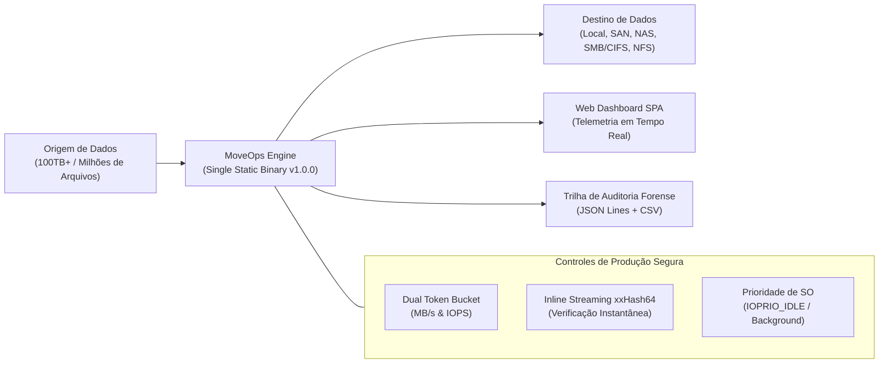

# MoveOps — Enterprise High-Performance Migration Engine

[](./documenta%C3%A7%C3%B5es/05-HISTORICO-DE-MUDANCAS-VERSIONADAS.md)
[](https://golang.org)
[](./web)
[](./ARCHITECTURE.md)
[]()

> Plataforma corporativa de sincronização e migração granular de dados em larga escala (100 TB+) entre ambientes Linux e Windows, assegurando **zero downtime operacional** e **impacto nulo nas cargas de trabalho em produção**.

---

## 1. Visão Geral da Arquitetura

O **MoveOps** foi projetado sob a premissa de que o gargalo real em migrações massivas de arquivos reside no barramento de I/O, nas filas de controladoras SAN/NAS e na contenção de rede. Por isso, introduz uma arquitetura de streaming com consumo fixo de memória ($O(1)$ RAM via `sync.Pool`), controle bidimensional de vazão e priorização de I/O em nível de kernel.



---

## 2. Destaques e Capacidades Técnicas

- **Single Static Binary (Zero Runtime Dependencies):** Executável autônomo compilado em Go com a interface Web (React/Vite/Tailwind) embutida via `go:embed`. Não requer Node.js, Python ou bibliotecas C externas nos servidores.
- **Dual Token Bucket Throttling:** Controle independente e reconfigurável em tempo real (*hot reloading*) de largura de banda (MB/s) e taxa de operações de disco (IOPS).
- **Inline Streaming xxHash64:** Validação de integridade bit-a-bit calculada durante o fluxo contínuo de transferência, economizando 50% de operações de I/O por dispensar leitura pós-cópia.
- **Suporte Nativo Multiplataforma (Linux & Windows):**
  - **Linux:** Priorização de I/O em background (`ioprio_set` classe `IOPRIO_CLASS_IDLE`).
  - **Windows:** Suporte integral a caminhos longos Win32 (`\\?\`) suportando até 32.767 caracteres sem estouro de buffer `MAX_PATH`.
- **Delta Sync Multi-Pass:** Sincronização inteligente apenas de arquivos modificados ou ausentes, permitindo rodar múltiplos ciclos prévios sem interromper a produção.
- **Auditoria Forense Integrada:** Relatórios analíticos em CSV e registros cronológicos de eventos em JSON Lines emitidos para cada job.

---

## 3. Estrutura do Repositório

```text
├── cmd/
│   ├── hypersync/           # Ponto de entrada da aplicação unificada MoveOps
│   └── server/              # Servidor HTTP/WebSocket e API headless
├── pkg/
│   ├── api/                 # Handlers REST, WebSocket feed e roteamento
│   ├── audit/               # Geração de relatórios CSV e logs JSON Lines
│   ├── discovery/           # Descoberta de discos, montagens e volumes
│   ├── engine/              # Orquestrador da migração, workers e pipeline
│   ├── platform/            # Syscalls específicas de SO (Linux ioprio / Win32)
│   ├── ratelimit/           # Dual Token Bucket (MB/s e IOPS limiter)
│   ├── scanner/             # Varredura hierárquica e filtros por data/extensão
│   └── ui/                  # Console TUI interativo e visualizadores de terminal
├── web/                     # Frontend SPA em React 18, Vite e TailwindCSS
│   ├── src/                 # Componentes, dashboards e serviços de API
│   ├── dist/                # Assets pré-compilados para embutimento no binário
│   └── embed.go             # Diretiva go:embed para inclusão no binário Go
├── test/                    # Bateria de testes de integração, resiliência e estresse
├── documentações/           # Documentação técnica oficial detalhada (00 a 07)
├── ARCHITECTURE.md          # Especificação arquitetural de baixo nível
└── SECURITY_AUDIT.md        # Relatório de auditoria de segurança e compliance
```

---

## 4. Guia Rápido de Compilação e Execução

### 4.1 Pré-requisitos (Estação de Build)
- Go 1.22+ (recomendado Go 1.26+)
- Node.js 18+ e NPM (necessário apenas para regenerar os assets do frontend)

### 4.2 Compilação do Frontend
```bash
cd web
npm install
npm run build
cd ..
```

### 4.3 Compilação Estática dos Binários

**Linux (ELF 64-bit Estático):**
```bash
GOOS=linux GOARCH=amd64 CGO_ENABLED=0 go build \
  -ldflags="-s -w -X 'main.AppVersion=1.0.0'" \
  -o bin/moveops \
  ./cmd/hypersync
```

**Windows (PE 64-bit Estático):**
```bash
GOOS=windows GOARCH=amd64 CGO_ENABLED=0 go build \
  -ldflags="-s -w -X 'main.AppVersion=1.0.0'" \
  -o bin/moveops.exe \
  ./cmd/hypersync
```

### 4.4 Executando o MoveOps
Para iniciar o servidor com o Dashboard Web integrado:
```bash
./bin/moveops --server --port 8080
```
Acesse a interface pelo navegador em: `http://localhost:8080`

Para execução em modo CLI não interativo (exemplo de produção segura):
```bash
./bin/moveops \
  --src /dados/producao \
  --dst /backup/destino \
  --rate 50 \
  --iops 300 \
  --workers 4 \
  --delta \
  --audit
```

---

## 5. Índice da Documentação Oficial

Para documentação exaustiva de cada camada técnica, consulte os manuais em [`documentações/`](./documenta%C3%A7%C3%B5es):

1. [**00. Sumário Executivo e Mapa de Navegação**](./documenta%C3%A7%C3%B5es/00-INDICE-GERAL.md)
2. [**01. Arquitetura e Especificação Técnica**](./documenta%C3%A7%C3%B5es/01-ARQUITETURA-E-ESPECIFICACAO-TECNICA.md)
3. [**02. Laudo de Segurança e Conformidade**](./documenta%C3%A7%C3%B5es/02-LAUDO-DE-SEGURANCA-E-COMPLIANCE.md)
4. [**03. Manual de Operação e Produção Segura**](./documenta%C3%A7%C3%B5es/03-MANUAL-DE-OPERACAO-E-PRODUCAO-SEGURA.md)
5. [**04. Relatório de Homologação e Testes QA**](./documenta%C3%A7%C3%B5es/04-RELATORIO-DE-HOMOLOGACAO-E-TESTES-QA.md)
6. [**05. Histórico de Mudanças Versionadas (Changelog)**](./documenta%C3%A7%C3%B5es/05-HISTORICO-DE-MUDANCAS-VERSIONADAS.md)
7. [**06. Guia de Implantação e Compilação**](./documenta%C3%A7%C3%B5es/06-GUIA-DE-IMPLANTACAO-E-COMPILACAO.md)
8. [**07. Guia Passo a Passo de Instalação e Testes**](./documenta%C3%A7%C3%B5es/07-GUIA-PASSO-A-PASSO-INSTALACAO-E-TESTES.md)

---

## 6. Versionamento Semântico e Release Policy

Este repositório adota estritamente o padrão [Semantic Versioning 2.0.0 (SemVer)](https://semver.org/lang/pt-BR/):
- **MAJOR (`vX.0.0`):** Mudanças incompatíveis de API, quebras estruturais ou migração de formato de dados.
- **MINOR (`v1.X.0`):** Adição de novas funcionalidades com retrocompatibilidade garantida.
- **PATCH (`v1.0.X`):** Correções de bugs, ajustes de performance e patches de segurança mantendo total compatibilidade.

As tags de release oficiais são assinadas no formato `vMAJOR.MINOR.PATCH` (ex: `v1.0.0`).
