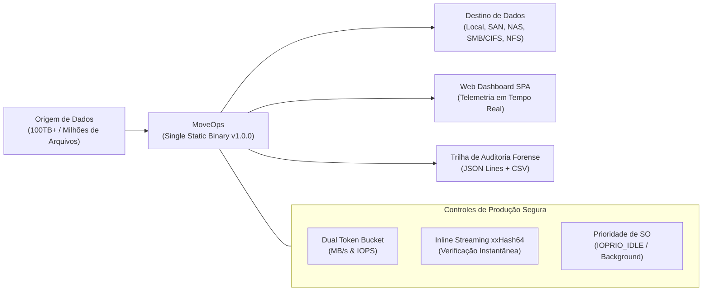

# MoveOps — Documentação Técnica Oficial v1.0.0
## 00. Sumário Executivo, Índice Geral e Mapa de Navegação

---

### Controle do Documento
* **Projeto:** MoveOps
* **Versão Homologada:** v1.0.0 Enterprise Release
* **Data de Publicação:** 06 de Outubro de 2026
* **Status:** Liberado para Produção (Cleared for Production)
* **Classificação:** Documentação Técnica Corporativa & Engenharia de Sistemas

---

## 1. Sumário Executivo

O **MoveOps** é uma plataforma corporativa de alta performance e resiliência desenvolvida para executar **migrações em larga escala de dados não-estruturados (100 TB+)** entre ambientes homogêneos ou heterogêneos (**Linux** e **Windows**), assegurando **zero downtime operacional** e **impacto nulo nas cargas de trabalho em produção**.

Projetado sob a premissa de que *o gargalo real em migrações massivas de arquivos reside no barramento de I/O, nas filas de controladoras SAN/NAS e na contenção de rede — e não na velocidade bruta de CPU do host* —, o MoveOps introduz uma arquitetura de streaming sem alocação contínua de memória ($O(1)$ RAM), aliada a um controle rigoroso de vazão por meio de **Dual Token Bucket Throttling** e **priorização de I/O em nível de kernel**.



> [!IMPORTANT]
> **Princípio Central do Sistema:** O MoveOps foi concebido para que os servidores de produção continuem operando normalmente enquanto a migração ocorre em segundo plano. Nenhum serviço, banco de dados ou usuário ativo deve sofrer lentidão ou indisponibilidade durante o processo.

---

## 2. Mapa Estrutural da Documentação Técnica

Esta base de conhecimento está subdividida em **8 volumes técnicos especializados (00 a 07)**, cobrindo desde a fundamentação matemática e arquitetural até os laudos formais de segurança, manuais de operação, procedimentos de compilação e o roteiro prático passo a passo de testes:

| Documento | Título Oficial | Foco Principal | Público-Alvo Preferencial |
| :--- | :--- | :--- | :--- |
| **`00-INDICE-GERAL.md`** | **Sumário Executivo e Mapa de Navegação** | Visão geral da documentação, perfis de leitura e índice de referência. | *Todos os perfis* |
| **[`01-ARQUITETURA-E-ESPECIFICACAO-TECNICA.md`](./01-ARQUITETURA-E-ESPECIFICACAO-TECNICA.md)** | **Arquitetura e Especificação Técnica** | 11 RFs, 6 RNFs, Multi-Pass Sync, Go vs Rust, Token Bucket dual, xxHash64 e Win32/Linux APIs. | *Arquitetos de Software, Tech Leads, Engenheiros de Sistemas* |
| **[`02-LAUDO-DE-SEGURANCA-E-COMPLIANCE.md`](./02-LAUDO-DE-SEGURANCA-E-COMPLIANCE.md)** | **Laudo de Segurança e Conformidade** | Auditoria formal, mitigação dos 12 vetores, isolamento do embed.FS, syscalls, checkpoints e liberação v1.0.0. | *CISO, Auditores de Segurança, Engenheiros de SecOps* |
| **[`03-MANUAL-DE-OPERACAO-E-PRODUCAO-SEGURA.md`](./03-MANUAL-DE-OPERACAO-E-PRODUCAO-SEGURA.md)** | **Manual de Operação e Produção Segura** | Throttling seguro (50 MB/s, 300 IOPS, 4 Workers), presets, Dashboard Web, 6 abas, REST e WebSockets. | *SysAdmins, Operadores de Infraestrutura, DBAs, SREs* |
| **[`04-RELATORIO-DE-HOMOLOGACAO-E-TESTES-QA.md`](./04-RELATORIO-DE-HOMOLOGACAO-E-TESTES-QA.md)** | **Relatório de Homologação e Testes QA** | Execução dos 17 testes (100% PASS), estresse de caminhos longos (>350 UTF-8), crash recovery e Delta Sync. | *Engenheiros de QA, Analistas de Testes, Auditores de Release* |
| **[`05-HISTORICO-DE-MUDANCAS-VERSIONADAS.md`](./05-HISTORICO-DE-MUDANCAS-VERSIONADAS.md)** | **Histórico de Mudanças Versionadas (Changelog)** | Registro detalhado da release v1.0.0, módulos alterados, correções e roadmap evolutivo. | *Gerentes de Projeto, Desenvolvedores, Mantenedores* |
| **[`06-GUIA-DE-IMPLANTACAO-E-COMPILACAO.md`](./06-GUIA-DE-IMPLANTACAO-E-COMPILACAO.md)** | **Guia de Implantação e Compilação** | Compilação estática (`CGO_ENABLED=0`), pacotes Linux/Windows, flags CLI, systemd e Windows Service. | *Engenheiros de DevOps, Release Managers, Administradores* |
| **[`07-GUIA-PASSO-A-PASSO-INSTALACAO-E-TESTES.md`](./07-GUIA-PASSO-A-PASSO-INSTALACAO-E-TESTES.md)** | **Guia Passo a Passo de Instalação e Testes** | Roteiro prático hands-on para Linux e Windows, execução standalone/nohup/systemd/NSSM, firewall, simulação em 5 passos e troubleshooting. | *SysAdmins, Técnicos de Suporte, Analistas de Infraestrutura, Operadores de Campo* |

---

## 3. Guia de Leitura por Perfil de Atuação

Para otimizar o tempo de assimilação técnica, recomenda-se a seguinte trilha de leitura conforme a responsabilidade do profissional:

### 3.1 Para Administradores de Sistemas e Operadores de Infraestrutura (SysAdmins / SREs)
1. **Para implantação rápida hands-on:** Comece por [`07-GUIA-PASSO-A-PASSO-INSTALACAO-E-TESTES.md`](./07-GUIA-PASSO-A-PASSO-INSTALACAO-E-TESTES.md) para copiar o binário pronto, liberar portas e rodar a primeira migração de teste em 5 passos.
2. **Para entender a operação em profundidade:** Consulte [`03-MANUAL-DE-OPERACAO-E-PRODUCAO-SEGURA.md`](./03-MANUAL-DE-OPERACAO-E-PRODUCAO-SEGURA.md) para dominar as diretrizes de Produção Segura, presets de throttling e o uso das 6 abas segmentadas da interface.
3. **Para serviços em produção e empacotamento:** Consulte [`06-GUIA-DE-IMPLANTACAO-E-COMPILACAO.md`](./06-GUIA-DE-IMPLANTACAO-E-COMPILACAO.md) para compilação estática avançada, systemd e Windows Service.
4. **Mantenha como referência:** [`02-LAUDO-DE-SEGURANCA-E-COMPLIANCE.md`](./02-LAUDO-DE-SEGURANCA-E-COMPLIANCE.md) caso necessite responder a questionamentos da equipe corporativa de segurança da informação.

### 3.2 Para Arquitetos de Solução e Líderes Técnicos
1. **Inicie por:** [`01-ARQUITETURA-E-ESPECIFICACAO-TECNICA.md`](./01-ARQUITETURA-E-ESPECIFICACAO-TECNICA.md) para entender as decisões fundamentais de engenharia, como a escolha de Golang sobre Rust, o algoritmo Dual Token Bucket, a estratégia de Multi-Pass Sync e o modelo de memória $O(1)$.
2. **Consulte em seguida:** [`04-RELATORIO-DE-HOMOLOGACAO-E-TESTES-QA.md`](./04-RELATORIO-DE-HOMOLOGACAO-E-TESTES-QA.md) para validar a cobertura de testes de integração, simulações de crash recovery e estresse com nomes estendidos.
3. **Consulte:** [`05-HISTORICO-DE-MUDANCAS-VERSIONADAS.md`](./05-HISTORICO-DE-MUDANCAS-VERSIONADAS.md) para analisar o ciclo de vida do código e planejamento de releases futuras.

### 3.3 Para Auditores de Segurança e Especialistas em Compliance
1. **Inicie por:** [`02-LAUDO-DE-SEGURANCA-E-COMPLIANCE.md`](./02-LAUDO-DE-SEGURANCA-E-COMPLIANCE.md) para verificar a análise estática dos 12 vetores de ataque auditados (CWE-22 Path Traversal, File Descriptor leaks, Go embed.FS sandbox, privilégios de syscall).
2. **Consulte em seguida:** Seção 7 de [`01-ARQUITETURA-E-ESPECIFICACAO-TECNICA.md`](./01-ARQUITETURA-E-ESPECIFICACAO-TECNICA.md) para inspecionar o esquema de dados do log de auditoria forense JSON Lines e CSV.
3. **Valide os testes em:** [`04-RELATORIO-DE-HOMOLOGACAO-E-TESTES-QA.md`](./04-RELATORIO-DE-HOMOLOGACAO-E-TESTES-QA.md) na seção de integridade da trilha de auditoria UTF-8.

---

## 4. Glossário Técnico e Convenções

A tabela a seguir consolida termos técnicos padronizados adotados ao longo de todos os documentos da base:

| Termo | Significado no Contexto do MoveOps |
| :--- | :--- |
| **Baseline Sync (Fase 1)** | Etapa inicial de cópia em massa (bulk), onde o volume primário de dados (tipicamente 95%+) é transferido de forma contínua com throttling ativo. |
| **Delta Sync (Fase 2)** | Etapa incremental iterativa que avalia rapidamente metadados (`mtime` e tamanho) e transfere exclusivamente arquivos modificados ou criados após a baseline. |
| **Cutover Final (Fase 3)** | Janela residual ultracurta (minutos ou segundos) para fechamento final de conexões e sincronização do delta remanescente com tolerância zero a discrepâncias. |
| **Dual Token Bucket** | Estrutura de contenção de fluxo que gerencia independentemente dois baldes de tokens: **Bytes por segundo (MB/s)** e **Operações de I/O por segundo (IOPS)**. |
| **xxHash64** | Algoritmo não-criptográfico de hashing de altíssima velocidade (>10 GB/s por núcleo), ideal para integridade de streaming sem gargalo de CPU. |
| **Extended-Length Path (`\\?\`)** | Prefixo de caminho da Win32 API que remove a barreira histórica de 260 caracteres (`MAX_PATH`), permitindo até 32.767 caracteres no NTFS. |
| **Hot Reloading de Limites** | Capacidade de alterar os parâmetros de largura de banda e IOPS em tempo real via REST ou Web UI sem pausar ou interromper a migração em andamento. |
| **Single Static Binary** | Executável único compilado estaticamente (`CGO_ENABLED=0`), contendo em seu próprio corpo o executável do backend e os assets do frontend React via `go:embed`. |
| **IOPRIO_CLASS_IDLE / BE** | Classes de escalonamento de prioridade de I/O do kernel Linux (`ionice`), assegurando que processos de produção tenham prioridade absoluta no disco. |
| **PROCESS_MODE_BACKGROUND_BEGIN** | Modo de processo do Windows acionado via Win32 API que coloca threads em prioridade de background para leitura e gravação em disco. |

---

## 5. Resumo da Matriz de Conformidade e Releases

```
[ MoveOps v1.0.0 Enterprise Release ]
├── Plataforma: Linux (Kernel 3.10+ amd64/arm64) & Windows (Server 2012+ / Win 10+)
├── Compilação: Go 1.22+ (Static CGO_ENABLED=0, No External Dynamic Libs)
├── Interface Web: React 18 SPA + Vite + Tailwind CSS (Embarcada via embed.FS)
├── Mecanismo de Hashing: xxHash64 Inline Streaming (>10 GB/s por core)
├── Throttling Padrão: 50 MB/s | 300 IOPS | 4 Workers Concorrentes
├── Status de Segurança: 12 Vetores Mitigados | Zero Vulnerabilidades Conhecidas
└── Homologação QA: 17/17 Testes Aprovados (100% PASS Rate)
```

> [!TIP]
> Utilize o sumário acima como índice geral para navegar diretamente aos capítulos temáticos. Todos os documentos mantêm formatação rigorosa e referências cruzadas entre si.
