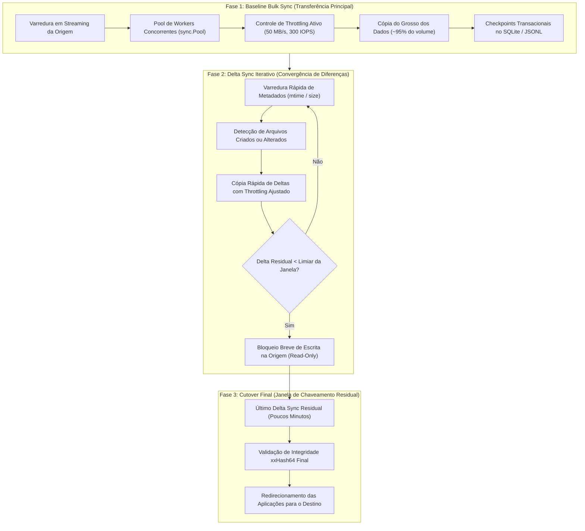

# MoveOps — Documentação Técnica Oficial v1.0.0
## 01. Arquitetura e Especificação Técnica

---

### Controle do Documento
* **Projeto:** MoveOps
* **Documento Técnico:** Especificação Arquitetural e de Engenharia de Software
* **Versão Homologada:** v1.0.0 Enterprise Release
* **Data:** 06 de Outubro de 2026
* **Status:** Aprovado e Homologado para Produção

---

## 1. Visão Geral e Contexto de Negócio

### 1.1 O Desafio Corporativo de Migrações em Escala (100 TB+)
A migração de repositórios corporativos de dados desestruturados (100 TB ou mais, contendo dezenas de milhões de arquivos, estruturas com milhares de subpastas aninhadas e arquivos de centenas de gigabytes) impõe um dilema crítico à Engenharia de Infraestrutura e Armazenamento:
- **Sobrecarga de Produção:** Utilitários legados de sincronização (tais como `rsync`, `robocopy` ou scripts de cópia paralela) operam em regime desgovernado de consumo de barramento. Eles esgotam a fila de I/O das controladoras de disco (*queue depth*), saturam portas de comutadores SAN Fibre Channel / NAS Ethernet e elevam expressivamente a latência de I/O (*I/O wait*), degradando ou derrubando bancos de dados relacionais e sistemas transacionais em execução nos mesmos servidores.
- **Inviabilidade de Downtime:** Janelas de manutenção convencionais (finais de semana) comportam no máximo alguns terabytes. A uma taxa média de rede de 200 MB/s, uma transferência a frio de 100 TB demanda **aproximadamente 6 dias ininterruptos de paralisação total**. Nenhuma corporação moderna tolera 6 dias de indisponibilidade.
- **Heterogeneidade de Sistemas de Arquivos:** Operações corporativas exigem trânsito confiável entre **Linux** (ext4, XFS, Btrfs) e **Windows** (NTFS, ReFS, SMB/CIFS shares), demandando tratamento estrito de disparidades de representação de caminhos, atributos de arquivo e limites históricos de tamanho de nomes (`MAX_PATH` de 260 caracteres no Win32).
- **Exigência de Rastreabilidade e Auditoria Forense:** Ambientes regulados (HIPAA, LGPD, SOX, PCI-DSS) exigem prova matemática irrevogável de que cada arquivo copiado possui exatamente o mesmo conteúdo binário que seu original na origem, com registro estruturado de tempo, tamanho, taxa de vazão e hashes de integridade.

### 1.2 Objetivos Centrais do MoveOps
O MoveOps foi concebido do zero para resolver esse impasse, operando sob 5 pilares fundamentais:
1. **Zero Downtime Operacional:** Clientes e aplicações de produção continuam criando, alterando e consultando arquivos na origem sem interrupção de serviço.
2. **Throttling Dual Rigoroso:** Controle matemático estrito de vazão máxima (MB/s) e operações por segundo (IOPS), ajustáveis em tempo real sem interrupção do job.
3. **Multi-Pass Sync com Detecção Inteligente de Deltas:** Estratégia em fases que reduz a janela de chaveamento final (*cutover*) a poucos segundos ou minutos.
4. **Resiliência e Recuperação Automática pós-Queda (Crash Recovery):** Checkpointing estruturado em SQLite WAL / JSON Lines que permite retomada instantânea (*resume*) a partir do último byte confirmado.
5. **Autonomia e Binário Único:** Nenhuma dependência externa de runtime (.NET, Java, Python, Node.js) e interface web moderna SPA embutida nativamente via `go:embed`.

---

## 2. Requisitos do Sistema

### 2.1 Requisitos Funcionais (RF)

| ID | Requisito Funcional | Descrição Técnica e Escopo de Implementação |
| :--- | :--- | :--- |
| **RF-01** | **Descoberta Nativa de Discos e Volumes** | Identificar e listar dinamicamente discos físicos, partições lógicas, pontos de montagem, volumes mapeados de rede (UNC/SMB/CIFS e NFS), sistemas de arquivos, espaço total e espaço disponível no host (Linux e Windows). |
| **RF-02** | **Seleção de Origem e Destino com Validação** | Permitir ao operador selecionar caminhos locais ou remotos de origem e destino, validando privilégios efetivos de leitura na origem e escrita/criação no destino antes do início da transferência. |
| **RF-03** | **Migração Multi-Pass com Delta Sync** | Executar a sincronização em etapas progressivas: cópia em massa (Baseline Bulk Sync), passagens diferenciais rápidas (Delta Sync) e fase final de chaveamento (Cutover). |
| **RF-04** | **Throttling Parametrizável (MB/s e IOPS)** | Possibilitar a configuração de limites máximos de transferência em Megabytes por segundo (MB/s) e Operações por segundo (IOPS), com suporte a reconfiguração a quente (*hot reloading*). |
| **RF-05** | **Filtros Granulares de Temporalidade** | Permitir filtros avançados por: (a) Migração Integral; (b) Por Ano específico; (c) Por Mês/Ano; (d) Por Dia específico; (e) Por Intervalo `[Data Inicial, Data Final]`; (f) Por Idade relativa (ex: arquivos com mais de 180 dias). |
| **RF-06** | **Filtros por Metadados e Padrões (Glob/Regex)** | Suportar inclusão/exclusão de arquivos baseada em padrões de extensão (glob), expressões regulares, limites de tamanho mínimo e tamanho máximo em bytes. |
| **RF-07** | **Verificação Inline de Integridade (xxHash64)** | Computar somas de verificação progressivas durante o fluxo de I/O em memória, garantindo integridade sem necessidade de releitura pós-cópia no disco. |
| **RF-08** | **Preservação de Atributos e Timestamps** | Preservar integralmente timestamps de última modificação (`mtime`), data de acesso (`atime`) e atributos de sistema entre sistemas de arquivos suportados. |
| **RF-09** | **Checkpointing Transacional e Resume** | Persistir estado de conclusão por arquivo em base leve/log estruturado, viabilizando retomada imediata e consistente em caso de cancelamento, interrupção ou queda de energia. |
| **RF-10** | **Auditoria Estruturada e Relatórios Consolidados** | Registrar trilha de auditoria linha a linha em formato JSON Lines (`audit.jsonl`) e CSV (`audit.csv`), além de disponibilizar relatório sumarizado consolidado de performance e falhas. |
| **RF-11** | **Interface Web SPA e Telemetria em Tempo Real** | Prover painel web moderno com monitoramento instantâneo via WebSocket (throughput atual em MB/s, IOPS em tempo real, percentual de conclusão, arquivos restantes, ETA e logs). |

### 2.2 Requisitos Não-Funcionais (RNF)

| ID | Requisito Não-Funcional | Meta Arquitetural e Métricas de Aceitação |
| :--- | :--- | :--- |
| **RNF-01** | **Pegada Bounded de Memória ($O(1)$ RAM)** | O consumo de memória RAM do processo não deve crescer linearmente com o número de arquivos migrados. Arquitetura baseada em streaming com canais limitados e buffers reciclados via `sync.Pool`, mantendo uso $< 150\text{ MB}$ para inventários com mais de 50 milhões de arquivos. |
| **RNF-02** | **Não-Intrusividade na Produção** | O impacto da migração na latência de leitura e gravação dos sistemas de produção deve permanecer abaixo de $5\%$. Utilização de chamadas de sistema para priorização mínima de I/O (`IOPRIO_CLASS_IDLE`/`BE` no Linux e `PROCESS_MODE_BACKGROUND_BEGIN` no Windows). |
| **RNF-03** | **Portabilidade Estática sem Dependências** | Binário único autônomo compilado de forma 100% estática (`CGO_ENABLED=0`), executável sem necessidade de instalação de bibliotecas externas de C (glibc/musl) ou runtimes adicionais. |
| **RNF-04** | **Suporte Nativo a Caminhos Longos (>260 caracteres)** | Neutralização completa do limite `MAX_PATH` do Windows, com normalização automática para namespaces estendidos do kernel NT (`\\?\` e `\\?\UNC\`) e suporte a caminhos POSIX extensos no Linux (até 4096 caracteres). |
| **RNF-05** | **Alta Eficiência de CPU** | O algoritmo de hash deve processar a taxas superiores a $5\text{ GB/s}$ por núcleo de CPU, assegurando que o gargalo permaneça no barramento de I/O e liberando ciclos de processamento para as aplicações hospedeiras. |
| **RNF-06** | **Telemetria de Baixa Latência** | As métricas de desempenho devem ser propagadas da engine para o painel web com latência de atualização inferior a $500\text{ ms}$ via WebSocket persistente. |

---

## 3. Seleção de Tecnologia: Go vs. Rust

Para a implementação do motor de migração de alta performance cross-platform, avaliou-se exaustivamente duas linguagens de nível de sistemas modernas: **Go (Golang)** e **Rust**.

### 3.1 Matriz Comparativa Técnica

```
+------------------------------------+------------------------------------+------------------------------------+
| Critério de Engenharia             | Go (Golang 1.22+)                  | Rust (Edição 2021)                 |
+------------------------------------+------------------------------------+------------------------------------+
| Fator Limitante Real (I/O vs CPU)  | Excelente. O throughput de cópia é | Idêntico na prática. O barramento  |
|                                    | delimitado pela física dos discos  | PCIe e links SAN/NAS impõem o teto |
|                                    | e enlaces de rede, não pela CPU.   | físico antes de qualquer CPU bound.|
+------------------------------------+------------------------------------+------------------------------------+
| Concorrência e Pipeline            | Goroutines ultraleves (~2 KB cada) | Async com Tokio/Mio ou Rayon.      |
| de Processamento                   | com runtime M:N preemptivo e canais| Extremamente veloz, mas impõe alta |
|                                    | tipados. Simples e resiliente.     | complexidade de tempo de vida.     |
+------------------------------------+------------------------------------+------------------------------------+
| Gerenciamento de Memória & GC      | Coletor concorrente com pausas     | Zero GC (RAII e borrow checker).   |
| Overhead                           | < 1 ms. Com buffers reciclados via | Sem qualquer pausa, excelente para |
|                                    | sync.Pool, o GC fica quase inativo.| micro-latências sub-milissegundo.  |
+------------------------------------+------------------------------------+------------------------------------+
| Compilação Cruzada Estática        | Imbatível. Com CGO_ENABLED=0, o    | Exige toolchains C cruzadas        |
| (Linux <-> Windows)                | compilador Go compila de Linux     | (MinGW, musl-gcc) para gerar       |
|                                    | para Windows em segundos.          | binários Windows a partir do Linux.|
+------------------------------------+------------------------------------+------------------------------------+
| Embutimento de Frontend (SPA)      | Suporte nativo e oficial via       | Requer dependências externas como  |
| em Binário Único                   | diretiva de compilador go:embed.   | rust-embed ou include_dir!.        |
+------------------------------------+------------------------------------+------------------------------------+
| Syscalls e APIs Nacionais          | Pacotes maduros golang.org/x/sys   | Crates winapi e nix robustos,      |
| (Win32 e POSIX Unix)               | sem necessidade de unsafe boiler.  | porém exigem muitos blocos unsafe. |
+------------------------------------+------------------------------------+------------------------------------+
| Velocidade de Manutenção e Curva   | Altíssima legibilidade, compilação | Tempo de compilação lento, curva de|
| de Aprendizado Corporativo         | quase instantânea e fácil adoção.  | onboarding significativamente alta.|
+------------------------------------+------------------------------------+------------------------------------+
```

### 3.2 Veredito e Escolha Arquitetural: **Golang**
A linguagem selecionada como núcleo do MoveOps é **Go (Golang)**, fundamentada pelos seguintes pilares de engenharia:
1. **O Gargalo é I/O de Armazenamento:** Em operações de 100 TB com controle de vazão ativo (*throttling*), os nanossegundos economizados pelo gerenciamento manual de memória do Rust não trazem benefício prático mensurável frente à latência de 2 ms a 15 ms de discos mecânicos e filas de controladoras SAN.
2. **Neutralização do Garbage Collector via `sync.Pool`:** Implementando alocação zero no loop principal de transferência (reutilização de buffers de 1 MB para I/O e 256 KB para hashing), o heap do processo permanece estável e as pausas do Garbage Collector são indetectáveis.
3. **Distribuição Enterprise em Arquivo Único:** Go compila binários autossuficientes sem dependência de DLLs dinâmicas do C runtime (`msvcrt.dll` ou `glibc`). O administrador precisa apenas transportar um único arquivo executável para o host.
4. **Acoplamento Nativo com Interface Web:** O compilador Go embute os arquivos de build do React através da funcionalidade `embed.FS`, servindo a aplicação SPA via HTTP nativo com zero complexidade de empacotamento externo.

---

## 4. Estratégia de Migração Multi-Pass (Zero Downtime)

Para sincronizar repositórios corporativos ativos de 100 TB sem interrupção de produção, o MoveOps adota o modelo **Multi-Pass Sync (Sincronização Progressiva em Três Fases)**:



### 4.1 Detalhamento Operacional das Fases
1. **Fase 1 — Baseline Bulk Sync:** Transfere a grande massa de dados históricos (ex: 95 TB de 100 TB) enquanto os sistemas de produção continuam plenamente operacionais. O throttling seguro (padrão de 50 MB/s e 300 IOPS) assegura que a produção não sofra contenção de I/O.
2. **Fase 2 — Delta Sync Iterativo:** Uma ou mais passagens incrementais rápidas que analisam unicamente arquivos cuja data de modificação (`mtime`) ou tamanho divirja do destino. Cada iteração consome uma fração exponencialmente menor do tempo da fase anterior.
3. **Fase 3 — Cutover Final:** Com o volume residual de discrepâncias reduzido a poucos gigabytes, aplica-se uma breve janela de parada ou comutação para modo somente-leitura na origem. O último delta é sincronizado em questão de minutos, seguido da alteração dos apontamentos de rede (DNS, montagens CIFS/NFS).

---

## 5. Engenharia de Throttling Dual Token Bucket

### 5.1 O Desafio da Proteção Multidimensional de Recursos
Limitar apenas a taxa de transferência em Megabytes por segundo (MB/s) é insuficiente em cenários reais:
- Milhões de **pequenos arquivos** (ex: 4 KB) consomem pouquíssima banda de rede (ex: 1 MB/s), mas podem gerar **milhares de IOPS**, saturando a fila de comandos das controladoras de disco e derrubando a performance de bancos de dados no mesmo storage.
- Grandes **arquivos volumosos** (ex: ISOs ou VHDs de 50 GB) consomem poucos IOPS, mas podem **esgotar a banda da placa de rede**, causando perda de pacotes e timeouts em enlaces WAN/VPN corporativos.

Por essa razão, o MoveOps implementa um **Dual Token Bucket Rate Limiter** com controle simultâneo e independente sobre bytes e operações de I/O.

```
       Configuração Dinâmica (via Web UI / API)
             |                             |
             v                             v
      +--------------+              +--------------+
      |  Byte Token  |              |  IOPS Token  |
      |    Bucket    |              |    Bucket    |
      | (Cap: MB/s)  |              | (Cap: IOPS)  |
      +-------+------+              +-------+------+
              |                             |
              +--------------+--------------+
                             |
                             v
                    [ Gatekeeper de I/O ]
               Aguarda disponibilidade de AMBOS
                 os tokens antes da operação
                             |
                             v
               [ Leitura / Escrita no Disco ]
```

### 5.2 Modelo Matemático do Dual Token Bucket
Para uma taxa máxima de transferência $R_{\text{bytes}}$ (bytes/segundo) com capacidade de rajada (*burst*) $B_{\text{bytes}}$, e uma taxa de operações $R_{\text{iops}}$ com capacidade de rajada $B_{\text{iops}}$:
- A cada instante de tempo $t$, o saldo de tokens de bytes $T_b(t)$ é atualizado por:
  $$T_b(t) = \min\left(B_{\text{bytes}},\, T_b(t_{\text{prev}}) + R_{\text{bytes}} \cdot (t - t_{\text{prev}})\right)$$
- Similarmente, o saldo de tokens de IOPS $T_i(t)$ é computado por:
  $$T_i(t) = \min\left(B_{\text{iops}},\, T_i(t_{\text{prev}}) + R_{\text{iops}} \cdot (t - t_{\text{prev}})\right)$$

#### Protocolo de Consumo e Sleep Cooperativo
Antes de iniciar a leitura ou escrita de um bloco de $S$ bytes:
1. O worker requisita ao Gatekeeper $S$ tokens de bytes e $1$ token de IOPS.
2. Caso $T_b(t) < S$ ou $T_i(t) < 1$, o sistema calcula com exatidão o tempo de espera necessário:
   $$\Delta t = \max\left(\frac{S - T_b(t)}{R_{\text{bytes}}},\, \frac{1 - T_i(t)}{R_{\text{iops}}}\right)$$
3. A goroutine entra em suspensão cooperativa utilizando timers de alta precisão do runtime do Go (`time.NewTimer`), liberando o processador e eliminando consumo espúrio de CPU em *busy waiting*.

### 5.3 Hot Reloading Atômico em Tempo de Execução
Os parâmetros do Token Bucket residem em estruturas sincronizadas sob `sync.Mutex` no pacote `pkg/ratelimit`. Durante a madrugada, o operador pode elevar a vazão para 200 MB/s e 1.500 IOPS pelo painel web e, às 08h00, reduzi-la imediatamente para 30 MB/s e 150 IOPS, sem que nenhuma cópia precise ser abortada ou reiniciada.

---

## 6. Verificação de Integridade Progressiva (xxHash64)

### 6.1 Estratégia de Verificação em Três Níveis

```
[ Arquivo Identificado na Origem ]
                |
                v
+-------------------------------------------------------------+
| Nível 1: Verificação Rápida de Metadados                    |
| - Compara Size (tamanho exato em bytes)                     |
| - Compara mtime (timestamp com precisão de nanossegundos)   |
+-------------------------------------------------------------+
                |
       +--------+--------+
       |                 |
[Idêntico]          [Divergente ou Inexistente]
       |                 |
       v                 v
[ SKIP Instantâneo ] +----------------------------------------+
                     | Nível 2: Inline Streaming xxHash64     |
                     | - Leitura em chunks de 1MB da origem   |
                     | - Alimentação contínua da hash engine  |
                     | - Escrita no destino com rate limiting |
                     +----------------------------------------+
                                 |
                                 v
                     +----------------------------------------+
                     | Nível 3: Confirmação Atômica           |
                     | - Compara Hash Origem == Hash Destino  |
                     | - Preserva mtime via os.Chtimes        |
                     | - Grava evento no log de auditoria     |
                     +----------------------------------------+
```

### 6.2 Por que xxHash64 em vez de SHA-256 ou MD5?
- Algoritmos criptográficos como SHA-256 e MD5 possuem alto custo computacional: SHA-256 atinge cerca de 350 MB/s a 450 MB/s por núcleo de CPU. Em sistemas modernos de armazenamento com discos NVMe capazes de ler a 3.000 MB/s, o cálculo de SHA-256 torna-se o gargalo primário, saturando 8 ou mais núcleos de CPU.
- O **xxHash64** atinge taxas superiores a **10 GB/s por núcleo de CPU**, ultrapassando folgadamente o limite físico de barramento dos melhores subsistemas de armazenamento e rede, com taxa de colisão desprezível para detecção de corrupção de arquivos.
- **Inline Streaming Hasher:** O hash do arquivo é computado dinamicamente enquanto os blocos trafegam pelo buffer de memória entre a origem e o destino. A aplicação nunca precisa reler o arquivo do disco após a gravação para verificar sua integridade, **economizando 50% das operações de I/O de disco**.

---

## 7. Descoberta Cross-Platform de Armazenamento e Syscalls

### 7.1 Modelo Unificado de Volumes (`DiskVolume`)
O subsistema `pkg/discovery` abstrai as particularidades de cada sistema operacional, expondo uma estrutura padronizada para o backend e a interface web:

```go
type DiskVolume struct {
    ID           string `json:"id"`            // Ex: "C:" ou "/dev/sdb1"
    MountPoint   string `json:"mount_point"`   // Ex: "C:\" ou "/mnt/data"
    Label        string `json:"label"`         // Rótulo do volume
    FileSystem   string `json:"filesystem"`    // Ex: "NTFS", "ext4", "xfs", "NFS"
    TotalBytes   uint64 `json:"total_bytes"`   // Espaço total em bytes
    FreeBytes    uint64 `json:"free_bytes"`    // Espaço livre em bytes
    UsedBytes    uint64 `json:"used_bytes"`    // Espaço utilizado em bytes
    IsRotational bool   `json:"is_rotational"` // True para HDD mecânico, False para SSD/NVMe
    IsReadOnly   bool   `json:"is_read_only"`  // Flag de volume somente-leitura
}
```

### 7.2 Implementação Nativa em Linux (`disk_linux.go` e `priority_linux.go`)
1. **Enumeração de Montagens:** Varredura direta e parsing de `/proc/mounts` e `/etc/mtab`, identificando partições locais e montagens remotas (`nfs`, `cifs`, `smbfs`).
2. **Capacidade e Utilização:** Syscall `unix.Statfs(mountPoint, &stat)` para extrair blocos totais, blocos livres e tamanho de bloco (`Bsize`).
3. **Detecção de Mídia Rotacional:** Inspeção do subsistema sysfs em `/sys/block/<device>/queue/rotational` (retorna `1` para discos rígidos mecânicos e `0` para SSDs e NVMes).
4. **Priorização de I/O em Background (`ionice`):**
   - Invoca `unix.Syscall(unix.SYS_IOPRIO_SET, uintptr(IOPRIO_WHO_PROCESS), 0, uintptr(prio))`.
   - Aplica prioritariamente `IOPRIO_CLASS_IDLE`. Caso o ambiente (como containers Docker ou perfis de segurança seccomp restritos) recuse a operação (`-EPERM`), o motor executa fallback gracioso e automático para a classe `IOPRIO_CLASS_BE` (Best-Effort) no nível 7 (prioridade mínima de best-effort), assegurando que os serviços do host tenham precedência no escalonador de I/O do Linux.

### 7.3 Implementação Nativa em Windows (`disk_windows.go` e `priority_windows.go`)
1. **Enumeração de Unidades:** Chamada à Win32 API `GetLogicalDrives()` para obter a máscara de bits das unidades ativas (de `A:` a `Z:`).
2. **Classificação de Unidades:** Invocação de `GetDriveTypeW(driveRoot)` para distinguir entre `DRIVE_FIXED`, `DRIVE_REMOTE` (compartilhamentos SMB de rede) e `DRIVE_REMOVABLE`.
3. **Métricas de Armazenamento:** Chamada a `GetDiskFreeSpaceExW()` para obter volumes disponíveis respeitando cotas de usuário por volume.
4. **Inspeção de Sistemas de Arquivos:** Chamada a `GetVolumeInformationW()` para extrair nomes de volume e sistema de arquivos (`NTFS`, `ReFS`).
5. **Priorização em Background do Windows:**
   - Chamada à API Win32 `SetPriorityClass(GetCurrentProcess(), PROCESS_MODE_BACKGROUND_BEGIN)`.
   - Essa chamada instrui o escalonador do Windows a diminuir agressivamente a prioridade de I/O de disco para *Very Low*, abaixar a prioridade de CPU para *Idle* e otimizar o *working set* de memória do processo.
6. **Suporte a Extended-Length Paths (`\\?\`):**
   - No Windows, caminhos comuns sofrem com a barreira histórica de 260 caracteres (`MAX_PATH`). O MoveOps normaliza dinamicamente caminhos locais para o namespace estendido `\\?\C:\Caminho...` e compartilhamentos de rede para `\\?\UNC\servidor\share\...`, permitindo caminhos de até 32.767 caracteres sem truncamento ou falha.

---

## 8. Arquitetura da Solução e Contratos de Software

### 8.1 Diagrama de Componentes e Fluxo de Dados

```mermaid
graph TB
    subgraph ClientLayer["Camada de Apresentação (Frontend SPA)"]
        UI_Dash["Dashboard de Telemetria em Tempo Real"]
        UI_Config["Configurador de Throttling & Filtros"]
        UI_Browser["Seletor e Navegador de Discos/Diretórios"]
        UI_Audit["Visualizador & Exportador de Relatórios"]
    end

    subgraph ServerLayer["MoveOps (Single Static Binary)"]
        HTTP_Server["Servidor HTTP Nativo (Go http.Server)"]
        WSHub["WebSocket Hub (Broadcast de Telemetria)"]
        EmbedFS["embed.FS (Assets Compilados React SPA)"]

        subgraph CorePipeline["Core Engine Pipeline"]
            Scanner["Streaming Scanner (Zero Memory Allocation)"]
            FilterEngine["Motor de Filtros (Temporal, Regex, Tamanho)"]
            WorkerPool["Pool Concorrente de Workers (sync.Pool)"]
            RateLimiter["Dual Token Bucket Throttler (MB/s & IOPS)"]
            Hasher["Inline Streaming xxHash64 Engine"]
            PlatformSyscalls["Platform Layer (Syscalls & Path Normalizer)"]
        end

        subgraph StorageLayer["Camada de Auditoria & Persistência"]
            AuditLogger["Logger Transacional de Auditoria"]
            JSONL_Log[("Trilha de Auditoria (audit.jsonl)")]
            CSV_Log[("Relatório Consolidado (report.csv)")]
        end
    end

    UI_Dash <-->|WebSocket: /api/v1/ws (JSON)| WSHub
    UI_Config & UI_Browser & UI_Audit <-->|REST API: /api/v1/* (HTTP/JSON)| HTTP_Server
    HTTP_Server --- EmbedFS

    HTTP_Server --> Scanner
    Scanner --> FilterEngine
    FilterEngine --> WorkerPool
    WorkerPool <--> RateLimiter
    WorkerPool <--> Hasher
    WorkerPool <--> PlatformSyscalls
    WorkerPool --> AuditLogger
    AuditLogger --> JSONL_Log
    AuditLogger --> CSV_Log
    WorkerPool -.->|Métricas Periódicas| WSHub
```

---

### 8.2 Especificação dos Contratos de API REST (`/api/v1`)

#### 1. Descoberta de Discos e Armazenamento
* **Endpoint:** `GET /api/v1/disks`
* **Descrição:** Retorna a listagem de todos os discos e volumes montados no host.
* **Exemplo de Resposta HTTP 200:**
  ```json
  [
    {
      "id": "/dev/sda1",
      "mount_point": "/mnt/storage_origem",
      "label": "PRODUCAO_01",
      "filesystem": "ext4",
      "total_bytes": 109951162777600,
      "free_bytes": 12884901888000,
      "used_bytes": 97066260889600,
      "is_rotational": false,
      "is_read_only": false
    }
  ]
  ```

#### 2. Navegação e Validação de Permissões
* **Endpoint:** `POST /api/v1/browse`
* **Descrição:** Permite inspecionar diretórios e atesta permissões de leitura e gravação no caminho indicado.
* **Corpo da Requisição:**
  ```json
  {
    "path": "/mnt/storage_origem",
    "operation": "read"
  }
  ```

#### 3. Estimativa e Pré-visualização (Dry-Run Preview)
* **Endpoint:** `POST /api/v1/migration/preview`
* **Descrição:** Executa varredura preliminar sem transferir dados, computando volume total de arquivos, bytes elegíveis e tempo estimado (ETA).
* **Corpo da Requisição:**
  ```json
  {
    "source_dir": "/mnt/storage_origem",
    "destination_dir": "/mnt/storage_destino",
    "filters": {
      "mode": "FULL",
      "min_size_bytes": 0,
      "max_size_bytes": 0
    },
    "max_bandwidth_mb": 50,
    "max_iops": 300
  }
  ```

#### 4. Gerenciamento do Ciclo de Vida da Migração
* `POST /api/v1/migration/start` — Inicia novo job de migração.
* `POST /api/v1/migration/pause` — Pausa graciosamente os workers de cópia, mantendo o estado na memória.
* `POST /api/v1/migration/resume` — Retoma os workers imediatamente.
* `POST /api/v1/migration/stop` — Cancela a migração de forma segura, fechando descritores de arquivo abertos.
* `GET /api/v1/migration/status` — Retorna o estado atual e métricas consolidadas instantâneas.

#### 5. Ajuste a Quente de Throttling (*Hot Reloading*)
* **Endpoint:** `PATCH /api/v1/migration/rate-limit` (ou `POST /api/v1/limits`)
* **Descrição:** Aplica novos limites de MB/s e IOPS sem interromper o fluxo de transferência.
* **Corpo da Requisição:**
  ```json
  {
    "max_bandwidth_mb": 150.0,
    "max_iops": 1500
  }
  ```

#### 6. Exportação e Resumo de Auditoria
* `GET /api/v1/reports/summary?job_id=xxx` — Retorna sumário analítico com contagens de arquivos e taxas de vazão.
* `GET /api/v1/reports/export?job_id=xxx&format=csv` — Efetua o download do arquivo estruturado CSV ou JSONL.

---

### 8.3 Protocolo de WebSocket para Telemetria em Tempo Real (`/api/v1/ws`)
Ao conectar-se no endpoint `/api/v1/ws`, o cliente recebe atualizações periódicas a cada 200 ms contendo a evolução precisa da migração:

```json
{
  "type": "METRICS_UPDATE",
  "payload": {
    "job_id": "job-migration-100tb-01",
    "status": "RUNNING",
    "current_phase": "PHASE_1_BASELINE",
    "current_throughput_mbs": 48.72,
    "current_iops": 284,
    "limit_bandwidth_mb": 50.0,
    "limit_iops": 300,
    "total_files_discovered": 1250000,
    "files_copied": 348210,
    "files_skipped": 1205,
    "files_failed": 0,
    "total_bytes_discovered": 104857600000000,
    "bytes_transferred": 29384729100000,
    "progress_percent": 28.02,
    "active_workers": 4,
    "current_file": "/mnt/storage/projetos/2026/dataset_render_084.exr",
    "elapsed_seconds": 58920,
    "eta_seconds": 151200
  }
}
```

> [!NOTE]
> Para detalhes completos sobre a mitigação de vetores de vulnerabilidade e procedimentos de teste, consulte [`02-LAUDO-DE-SEGURANCA-E-COMPLIANCE.md`](./02-LAUDO-DE-SEGURANCA-E-COMPLIANCE.md) e [`04-RELATORIO-DE-HOMOLOGACAO-E-TESTES-QA.md`](./04-RELATORIO-DE-HOMOLOGACAO-E-TESTES-QA.md).
