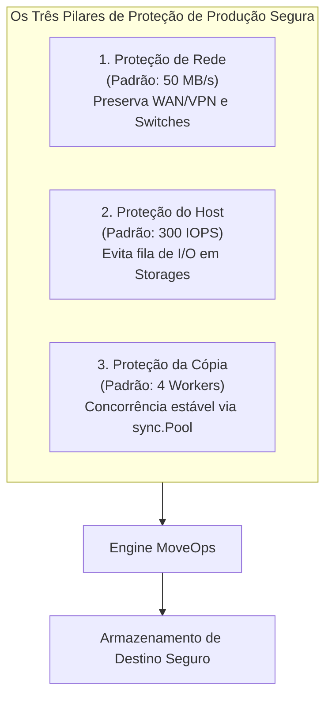
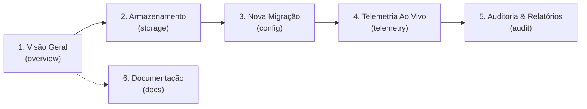

# MoveOps — Documentação Técnica Oficial v1.0.0
## 03. Manual de Operação e Produção Segura

---

### Controle do Documento
* **Projeto:** MoveOps
* **Documento Técnico:** Guia Operacional de Campo e Procedimentos de Produção Segura
* **Versão Homologada:** v1.0.0 Enterprise Release
* **Data:** 06 de Outubro de 2026
* **Status:** Homologado para Operação Contínua em Produção
* **Classificação:** Manual de Engenharia de Operações & Guia do Administrador (SysAdmin/SRE)

---

## 1. Filosofia de Operação: Modo Produção Segura

Em operações de migração de dados em larga escala (100 TB ou mais), o maior risco técnico não é a velocidade do processo, mas sim a **degradação colateral ou interrupção acidental dos sistemas de produção ativos**. Quando um processo de transferência opera sem limites estritos de taxa e concorrência, ele rapidamente induz:
1. **Saturação de Fila de Controladoras de Armazenamento:** A profundidade de fila (*queue depth*) de storages SAN ou matrizes NVMe/SAS atinge o teto físico, fazendo com que queries de bancos de dados concorrentes (Oracle, PostgreSQL, SQL Server) sofram aumentos súbitos de tempo de resposta (*I/O wait* de centenas de milissegundos).
2. **Esgotamento de Portas e Switches de Rede:** Transferências não limitadas ocupam 100% da banda em enlaces de agregação (LACP), uplinks de switches ToR (*Top of Rack*) ou canais de interconexão WAN/VPN, provocando descarte de pacotes (*packet drops*) e instabilidade em serviços vitais.
3. **Contenção de CPU e Fragmentação de Memória:** Dezenas de threads de cópia simultâneas causam disputa de locks de kernel e sobrecarga no Garbage Collector do sistema hospedeiro.

> [!IMPORTANT]
> **Definição de Produção Segura:** O MoveOps opera sob o conceito de **Produção Segura por Padrão (Safe-by-Default)**. Caso o operador inicie uma migração sem especificar parâmetros de taxa ou caso forneça valores zerados acidentalmente, o motor aplica automaticamente os limites protetivos padrão, resguardando a integridade do ambiente corporativo.

---

## 2. Os Três Pilares da Proteção de Produção

O MoveOps implementa uma arquitetura de proteção multidimensional baseada em três pilares integrados out-of-the-box:



### 2.1 Pilar 1: Proteção da Rede (Padrão: 50 MB/s)
* **Objetivo:** Garantir que o tráfego de migração não dispute agressivamente enlaces de rede com sistemas corporativos, backups concorrentes ou conexões de usuários.
* **Comportamento Técnico:** 
  - Limita o consumo agregado de largura de banda a **50 MB/s** (~400 Mbps), um patamar perfeitamente absorvido por interfaces modernas de 1 Gbps ou 10 Gbps sem saturar switches ou provocar descarte de quadros em interfaces compartilhadas.
  - A limitação é aplicada via **Token Bucket de Bytes**, que regula os blocos transmitidos com precisão milimétrica e sleep cooperativo.

### 2.2 Pilar 2: Proteção do Host e Armazenamento (Padrão: 300 IOPS)
* **Objetivo:** Evitar a exaustão de operações de I/O em discos magnéticos (HDDs), controladoras RAID e matrizes de armazenamento compartilhadas (SAN/NAS).
* **Comportamento Técnico:**
  - Limita as operações de entrada/saída a **300 IOPS** no total. Em migrações com milhões de pequenos arquivos (ex: arquivos de 4 KB a 64 KB), a restrição de IOPS é o fator primordial que impede o colapso das cabeças mecânicas de leitura e o esgotamento do cache da controladora.
  - Em conjunto com o rate limit, o processo assume automaticamente prioridade mínima no escalonador de I/O do sistema operacional (`IOPRIO_CLASS_IDLE`/`BE` no Linux e `PROCESS_MODE_BACKGROUND_BEGIN` no Windows).

### 2.3 Pilar 3: Proteção da Cópia e Memória (Padrão: 4 Workers Concorrentes)
* **Objetivo:** Assegurar paralelismo estável sem sobrecarregar a memória RAM ou provocar disputa por mutexes de sistema de arquivos.
* **Comportamento Técnico:**
  - O pool de transferência opera com **4 goroutines concorrentes de cópia**, número ótimo para manter fluidez sem gerar concorrência excessiva em tabelas de inodes ou tabelas MFT (*Master File Table* do NTFS).
  - Cada worker recicla blocos de leitura e escrita de 1 MB através de `sync.Pool`, garantindo que o footprint total de memória do motor permaneça contido em menos de 100 MB de RAM.

---

## 3. Presets Rápidos de Operação

Para simplificar a rotina das equipes de suporte e evitar erros manuais de cálculo de banda, o painel do MoveOps disponibiliza **4 Presets de Produção** pré-homologados:

| Preset Operacional | Taxa de Banda | Limite de IOPS | Concorrência | Perfil de Aplicação | Recomendação e Cuidados |
| :--- | :---: | :---: | :---: | :--- | :--- |
| **Produção Padrão** *(Recomendado)* | **50 MB/s** | **300 IOPS** | **4 Workers** | Operação regular em horário de expediente corporativo. | **Equilíbrio ideal.** Proteção máxima contra sobrecarga com taxa contínua previsível. |
| **Horário Comercial** *(Ultra-Seguro)* | **25 MB/s** | **150 IOPS** | **2 Workers** | Servidores compartilhados com ERPs, bancos de dados de alto tráfego ou links WAN restritos. | **Carga ultraleve.** Impacto inferior a 2% nos discos de origem; ideal para servidores sensíveis. |
| **Janela Noturna** *(Alta Vazão)* | **150 MB/s** | **1.500 IOPS** | **8 Workers** | Janelas de manutenção noturna, finais de semana e feriados com infraestrutura ociosa. | **Alta velocidade.** Aproveita folga de banda da rede; monitorar se storages executam backups paralelos. |
| **Dedicado / Manutenção** *(Ilimitado)* | **Ilimitado** | **Ilimitado** | **16 Workers** | Servidores dedicados exclusivamente à migração ou janelas de parada total (*Cutover*). | > [!CAUTION]<br/>**Uso Restrito:** Pode saturar switches de rede e elevar a fila de disco ao teto. |

---

## 4. Guia de Operação do Dashboard Web: Arquitetura de 6 Abas Corporativas

O MoveOps v1.0.0 incorpora uma interface web SPA moderna (Single Page Application) em React 18, Vite e Tailwind CSS, acessível por padrão no navegador corporativo em `http://<IP-DO-SERVIDOR>:8080`.

A interface foi estruturada em torno de uma barra de navegação superior fixa com **identidade visual corporativa** e **6 abas segmentadas de trabalho especializado**, proporcionando clareza de fluxo tanto para operações rotineiras quanto para auditorias e manutenções críticas.

```
+----------------------------------------------------------------------------------------------------------------------+
| [MoveOps Logo] MoveOps  |  [Visão Geral] [Armazenamento] [Nova Migração] [Telemetria (●)] [Auditoria] [Docs]  |
| Enterprise Zero-Downtime Engine |  [Fase 1: Baseline]  [● EM EXECUÇÃO]  [LIVE WebSocket]                              |
+----------------------------------------------------------------------------------------------------------------------+
```

### 4.1 Identidade Visual e Barra de Navegação Superior (Header)

A barra de navegação superior (`Navbar`) permanece acessível em todas as telas e reúne indicadores globais de telemetria e governança:
- **Logotipo Oficial Corporativo:** Exibição do logo oficial `logo-n-fundo.png` com fundo transparente e ícone de escudo de segurança (`ShieldCheck`), identificando a versão empresarial do sistema.
- **Abas Segmentadas de Acesso Rápido:** Alternância instantânea entre as 6 áreas de operação sem recarregamento de página (*zero page-reload*).
- **Badge Dinâmico de Fase:** Indica visualmente a etapa do job em voo (`Fase 1: Baseline`, `Fase 2: Delta Sync` ou `Fase 3: Cutover`).
- **Badge Animado de Status do Motor:**
  * `EM EXECUÇÃO` (Verde pulsante com indicador de atividade ativo)
  * `PAUSADO` (Âmbar — transferência congelada em memória com sockets abertos)
  * `CONCLUÍDO` (Ciano — finalizado com 100% de integridade confirmada)
  * `CANCELADO` / `FALHA` (Vermelho — parada com expurgo seguro de arquivos parciais)
  * `OCIOSO (IDLE)` (Cinza — pronto para receber novos jobs)
- **Status da Conexão WebSocket:** Indicador pulsante em tempo real (`LIVE` em verde quando conectado, âmbar em reconexão e vermelho caso desconectado).

---

### 4.2 Detalhamento Operacional das 6 Abas de Trabalho



#### Aba 1: Visão Geral (`OverviewTab`)
* **Propósito:** Painel executivo e centro de comando inicial do operador.
* **Componentes e Recursos:**
  - **KPI Cards de Alta Visibilidade:** Exibição instantânea do status do motor, jobs em execução, volume total migrado, taxa atual agregada e integridade do processo.
  - **Resumo de Capacidade:** Comparativo entre arquivos concluídos, pendentes e ignorados (*skipped*).
  - **Atalhos Rápidos de Ação:** Botões diretos para *"Iniciar Nova Migração"* (leva à Aba 3) ou *"Inspecionar Discos"* (leva à Aba 2).

#### Aba 2: Armazenamento & Volumes (`StorageTab`)
* **Propósito:** Inventário nativo de hardware, partições e sistemas de arquivos locais e remotos.
* **Componentes e Recursos:**
  - **Catálogo de Discos Detectados:** Lista todos os discos físicos e montagens de rede descobertos no Linux (`/dev/sd*`, `/mnt/*`, NFS, CIFS) e Windows (`C:\`, `D:\`, compartilhamentos UNC).
  - **Métricas por Volume:** Capacidade total, espaço livre disponível, espaço utilizado, percentual de ocupação com barra de progresso visual.
  - **Identificação de Mídia:** Distinção automática entre discos rotacionais mecânicos (HDDs) e armazenamento em estado sólido (SSDs/NVMe).
  - **Ações Imediatas:** Botões para definir um volume como *"Usar como Origem"* ou *"Usar como Destino"*, além de botão *"Navegar Pastas"* para explorar diretórios internos.

#### Aba 3: Nova Migração (`MigrationConfig`)
* **Propósito:** Assistente completo de parametrização e lançamento de tarefas de migração sob Produção Segura.
* **Componentes e Recursos:**
  - **Seleção de Origem e Destino com Validação:** Campos de caminho com botão de busca modal (`FileBrowserModal`) e validação prévia de privilégios de leitura e escrita.
  - **Estratégias de Migração:** Seleção entre *Migração Completa (Full)*, *Delta Sync (Apenas modificados/novos)* e *Particionamento Granular por Data* (por ano, mês, dia, intervalo ou retenção em dias).
  - **Filtros Avançados:** Inclusão/exclusão de extensões e padrões (glob/regex) e filtros de tamanho mínimo/máximo em bytes.
  - **Painel de Presets de Produção Segura:** Seleção em 1 clique entre os 4 perfis corporativos:
    * *Produção Padrão (50 MB/s • 300 IOPS • 4 Workers)* — Recomendado.
    * *Horário Comercial (25 MB/s • 150 IOPS • 2 Workers)* — Carga ultraleve.
    * *Janela Noturna (150 MB/s • 1500 IOPS • 8 Workers)* — Alta vazão.
    * *Dedicado / Manutenção (Ilimitado • Ilimitado • 16 Workers)* — Sem limites.
  - **Sliders Granulares de Ajuste Fino:** Controle individual com botões "Reset Padrão" para largura de banda, IOPS e workers concorrentes.
  - **Controle de Auditoria:** Opção para ativar relatório estruturado e definição da pasta de logs.
  - **Ações Finais:**
    * *Botão "Estimar / Pré-visualizar (Dry Run)":* Executa varredura preliminar sem cópia física e abre modal com estatísticas de volumetria e tempo estimado (ETA).
    * *Botão "Iniciar Migração no Engine":* Dispara o job de forma atômica e comuta automaticamente para a **Aba 4 (Telemetria)**.

#### Aba 4: Telemetria & Ao Vivo (`LiveDashboard` + `LiveFeedConsole`)
* **Propósito:** Central de monitoramento em tempo real e controle dinâmico em voo.
* **Componentes e Recursos:**
  - **Métricas em Tempo Real:** Velocidade atual de transferência (MB/s), IOPS instantâneo, percentual concluído, contagem de arquivos e estimativa de término (ETA).
  - **Gráfico Sparkline SVG Dinâmico:** Exibe a oscilação histórica das últimas 30 amostras de vazão com atualização contínua via WebSocket.
  - **Controles de Ciclo de Vida:** Botões com proteção visual para *Pausar*, *Retomar* e *Cancelar Migração* (com modal defensivo de confirmação).
  - **Ajuste Dinâmico a Quente (Hot Reloading):** Sliders para alterar banda máxima e IOPS em tempo de execução sem interrupção do job.
  - **Live Feed Console:** Terminal em streaming que registra em tempo real cada arquivo processado, indicando seu caminho, tamanho, ação (`COPIED`, `SKIPPED`), taxa individual e a validação da soma de verificação `xxHash64`.

#### Aba 5: Auditoria & Relatórios (`AuditReports`)
* **Propósito:** Gestão de conformidade corporativa, emissão de laudos e exportação de dados.
* **Componentes e Recursos:**
  - **Histórico Consolidado de Jobs:** Relação de tarefas executadas com status, datas de início/término e volumetria.
  - **Resumo Estatístico:** Taxa média e de pico de transferência, contagem de arquivos com sucesso vs ignorados vs falhas.
  - **Exportação com 1 Clique:** Download direto dos relatórios tabulares em **CSV** (`<job_id>_report.csv`) e trilhas completas de eventos estruturados em **JSON Lines** (`<job_id>_events.jsonl`).

#### Aba 6: Documentação Técnica Integrada (`DocsTab`)
* **Propósito:** Base de conhecimento oficial embutida diretamente na aplicação.
* **Componentes e Recursos:**
  - Permite aos operadores de campo consultar manuais de arquitetura, laudos de segurança, guias de throttling e especificações de API sem a necessidade de consultar arquivos externos ou sair da interface visual.

---

### 4.3 Fluxo Operacional Passo a Passo entre as Abas

```
[ PASSO 1: Aba 1 (Visão Geral) ]  ---> Avaliar saúde geral do host e capacidade livre
               |
               v
[ PASSO 2: Aba 2 (Armazenamento)] ---> Inspecionar discos, sistemas de arquivos e definir volumes
               |
               v
[ PASSO 3: Aba 3 (Nova Migração)] ---> Configurar pastas, filtros, selecionar Preset de Produção
               |                       e executar Dry-Run Preview
               v
[ PASSO 4: Aba 4 (Telemetria)   ] ---> Acompanhar vazão ao vivo, Sparkline e aplicar Hot Reloading
               |
               v
[ PASSO 5: Aba 5 (Auditoria)    ] ---> Validar 100% de integridade e exportar CSV/JSONL
```

---

## 5. Gerenciamento e Operação via API REST

Para automação corporativa via scripts Bash, PowerShell ou ferramentas de orquestração (Ansible, Jenkins), o MoveOps expõe contratos REST padronizados:

### 5.1 Iniciar Job de Migração
```bash
curl -X POST http://localhost:8080/api/v1/migration/start \
  -H "Content-Type: application/json" \
  -d '{
    "job_id": "job-prod-migracao-01",
    "source_dir": "/mnt/origem_dados",
    "destination_dir": "/mnt/destino_dados",
    "filters": {
      "mode": "DELTA"
    },
    "max_bandwidth_mb": 50.0,
    "max_iops": 300,
    "concurrency": 4,
    "audit_dir": "./audit_logs"
  }'
```

### 5.2 Consultar Telemetria Instantânea
```bash
curl -s http://localhost:8080/api/v1/migration/status | jq .
```
Exemplo de retorno JSON:
```json
{
  "job_id": "job-prod-migracao-01",
  "status": "RUNNING",
  "current_phase": "PHASE_2_DELTA",
  "current_throughput_mbs": 49.12,
  "current_iops": 296,
  "limit_bandwidth_mb": 50,
  "limit_iops": 300,
  "files_copied": 18450,
  "files_skipped": 412000,
  "files_failed": 0,
  "progress_percent": 74.3,
  "active_workers": 4,
  "eta_seconds": 1840
}
```

### 5.3 Aplicar Throttling a Quente via Linha de Comando
```bash
curl -X PATCH http://localhost:8080/api/v1/migration/rate-limit \
  -H "Content-Type: application/json" \
  -d '{
    "max_bandwidth_mb": 100.0,
    "max_iops": 800
  }'
```

### 5.4 Controle de Ciclo de Vida: Pausa, Retomada e Parada
* **Pausar graciosamente:** `curl -X POST http://localhost:8080/api/v1/migration/pause`
* **Retomar execução:** `curl -X POST http://localhost:8080/api/v1/migration/resume`
* **Cancelar com segurança:** `curl -X POST http://localhost:8080/api/v1/migration/stop`

---

## 6. Procedimentos de Contingência e Resolução de Problemas

### 6.1 Cenário: Servidor de Origem ou Destino Reiniciado Abruptamente (Crash Recovery)
* **Impacto:** O processo MoveOps foi finalizado com `SIGKILL` ou falta de energia enquanto transferia arquivos.
* **Procedimento de Contingência:**
  1. Reinicie o binário do MoveOps no servidor.
  2. Inicie um novo job informando os mesmos diretórios de origem e destino, selecionando o modo **Delta Sync**.
  3. O motor lê os checkpoints do arquivo `<job_id>_events.jsonl`, valida automaticamente que os arquivos anteriormente concluídos possuem hashes correspondentes e pula-os instantaneamente (*Zero Re-copy*).
  4. Qualquer arquivo que estivesse gravado de forma parcial no momento do corte de energia terá seu tamanho/mtime divergente identificado e será sobrescrito e retificado automaticamente com 100% de integridade xxHash64.

### 6.2 Cenário: Alerta de Latência em Aplicações Concorrentes
* **Impacto:** A equipe de DBA reportou leve elevação de latência no banco de dados corporativo compartilhado no mesmo storage.
* **Procedimento de Remediação Imediata:**
  1. Acesse o Dashboard Web do MoveOps.
  2. Aplique imediatamente o preset **Horário Comercial** (reduz para 25 MB/s e 150 IOPS).
  3. Observe se a prioridade em nível de sistema operacional está ativa: no Linux, verifique se o processo está associado à classe `idle` com o comando `ionice -p <PID>`.

---

## 7. Rastreabilidade e Auditoria Operacional

Ao final de cada janela de transferência, os artefatos de conformidade são gerados na pasta de auditoria (padrão `./audit_logs`):
1. **`<job_id>_events.jsonl`:** Trilha de eventos estruturada em JSON Lines com identificador de evento, caminhos absolutos, hashes de integridade de origem e destino, duração em milissegundos e taxa de vazão individual de cada arquivo.
2. **`<job_id>_report.csv`:** Relatório tabular para importação direta em planilhas eletrônicas (Excel, LibreOffice) e sistemas corporativos de BI.
3. **Resumo Executivo Web:** Disponível na aba **Auditoria & Relatórios** do painel web, permitindo a exportação imediata com um clique.
