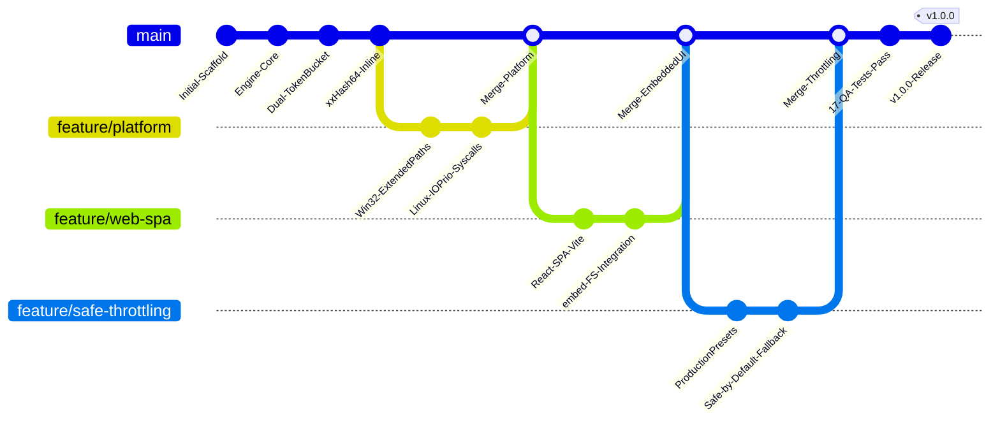

# MoveOps — Documentação Técnica Oficial v1.0.0
## 05. Histórico de Mudanças Versionadas (Changelog Oficial)

---

### Controle do Documento
* **Projeto:** MoveOps
* **Documento Técnico:** Registro de Mudanças Versionadas e Notas de Release (Changelog)
* **Versão Homologada:** v1.0.0 Enterprise Release
* **Data da Release:** 06 de Outubro de 2026
* **Classificação:** Histórico de Engenharia de Software e Gestão de Configuração

---

## 1. Visão Geral da Release v1.0.0 Enterprise

A versão **v1.0.0** representa a primeira entrega estável corporativa do **MoveOps**, consolidando a arquitetura de sincronização de dados não-intrusiva para grandes volumes (100 TB+), distribuição em binário único estático para Linux e Windows, frontend moderno embutido via `go:embed`, controle dimensional de throttling por Dual Token Bucket e resiliência ponta a ponta contra falhas de infraestrutura.

---

## 2. Detalhamento de Modificações por Componente

### 2.1 Core Engine (`pkg/engine`, `pkg/scanner`, `pkg/ratelimit`, `pkg/audit`)
* **[NOVO] Pipeline de Transferência em Streaming com `sync.Pool`:**
  - Implementação de workers assíncronos de cópia utilizando buffers de memória reciclados (1 MB por bloco de I/O), neutralizando alocações na Heap e mantendo o consumo de memória fixo em $O(1)$ ($< 150\text{ MB}$ de RAM total).
* **[NOVO] Inline Streaming Hashing (xxHash64):**
  - Integração do hasher xxHash64 durante o fluxo contínuo de dados. A integridade do arquivo é calculada simultaneamente à sua transmissão, economizando 50% de operações de I/O em disco ao eliminar a necessidade de releitura pós-cópia.
* **[NOVO] Dual Token Bucket Rate Limiter (`pkg/ratelimit`):**
  - Controle independente de largura de banda (MB/s) e operações de I/O (IOPS).
  - Suporte a reconfiguração em tempo real (*hot reloading*) sem travamento de threads ou interrupção do job ativo.
  - Implementação de timers cooperativos de alta precisão via runtime Go, eliminando queima de CPU em *busy waiting*.
* **[NOVO] Modo Produção Segura por Padrão (Safe-by-Default Fallback):**
  - Caso um job seja iniciado sem especificação de taxas ou com valores zerados acidentais, a engine injeta automaticamente as constantes protetivas de produção: **50 MB/s**, **300 IOPS** e **4 Workers Concorrentes**.
* **[NOVO] Mecanismo de Checkpointing Transacional e Logs Forenses (`pkg/audit`):**
  - Geração síncrona de eventos estruturados em formato JSON Lines (`<job_id>_events.jsonl`) e tabelas consolidadas em CSV (`<job_id>_report.csv`).
  - Reconstrutor com tolerância a falhas na inicialização: em caso de queda de energia durante uma escrita JSON, fragmentos de linha corrompidos são ignorados silenciosamente sem causar pânico no processo.
* **[MELHORIA] Limpeza Preventiva de Arquivos Parciais Corrompidos:**
  - Caso uma transferência seja cancelada no meio do fluxo, o arquivo parcial incompleto é imediatamente removido do destino com fechamento determinístico de descritores de arquivo (`defer destFile.Close()`).

---

### 2.2 Camada de Plataforma e Syscalls de Baixo Nível (`pkg/platform`, `pkg/discovery`)
* **[NOVO] Descoberta Automática de Discos Cross-Platform (`pkg/discovery`):**
  - **Linux:** Varredura nativa de `/proc/mounts`, extração de volumetria via syscall `unix.Statfs` e identificação de mídia rotacional (HDD vs SSD) consultando `/sys/block/<device>/queue/rotational`.
  - **Windows:** Enumeração de unidades via `GetLogicalDrives`, classificação de volumes com `GetDriveTypeW`, cálculo de cotas disponíveis via `GetDiskFreeSpaceExW` e recuperação de nomes de volume com `GetVolumeInformationW`.
* **[NOVO] Priorização de I/O em Nível de Kernel (`pkg/platform`):**
  - **Linux:** Syscall `unix.SYS_IOPRIO_SET` associando o processo à classe `IOPRIO_CLASS_IDLE`, com fallback transparente para `IOPRIO_CLASS_BE` prioridade 7 em ambientes conteinerizados sem `CAP_SYS_ADMIN`.
  - **Windows:** Invocação de `SetPriorityClass` com pseudo-handle `GetCurrentProcess()` ativando `PROCESS_MODE_BACKGROUND_BEGIN` (I/O muito baixo e CPU ociosa).
* **[NOVO] Normalização de Caminhos Estendidos (Extended-Length Paths):**
  - Suporte completo a caminhos de até 32.767 caracteres no Windows mediante injeção transparente dos prefixos `\\?\` (unidades locais) e `\\?\UNC\` (compartilhamentos de rede), neutralizando o limite `MAX_PATH` de 260 caracteres da API Win32.

---

### 2.3 Interface Web SPA Moderna (`web/` e `pkg/ui`)
* **[NOVO] Identidade Visual Corporativa Oficial (`logo-n-fundo.png`):**
  - Integração do logo corporativo oficial com transparência no cabeçalho superior (`Navbar`), acompanhado da insígnia institucional *Enterprise Zero-Downtime Engine* e escudo de segurança.
* **[NOVO] Arquitetura de Navegação com 6 Abas Segmentadas no Topo:**
  - Reestruturação completa do fluxo de navegação da interface SPA em 6 abas especializadas:
    1. **Visão Geral (`overview`):** KPIs executivos, cartões de volumetria total, status do cluster e atalhos operacionais rápidos.
    2. **Armazenamento & Volumes (`storage`):** Mapa visual de discos locais e montagens remotas (NTFS/ReFS/ext4/XFS/NFS), detecção de mídia Flash vs HDD rotacional e atalho para definição de origem/destino.
    3. **Nova Migração (`config`):** Assistente de parametrização com seletor de pastas, validação prévia de permissões, modos Full/Delta/Granular por data, filtros glob/regex e painel de Presets de Produção Segura.
    4. **Telemetria & Ao Vivo (`telemetry`):** Dashboard com gráfico Sparkline de vazão em tempo real, controles de ciclo de vida em voo (pausar, retomar, cancelar), Hot Reloading a quente e terminal *Live Feed Console* com hashes xxHash64 em streaming.
    5. **Auditoria & Relatórios (`audit`):** Central de conformidade e governança para consulta de histórico de jobs e download em 1 clique de relatórios tabulares em CSV e eventos estruturados em JSON Lines.
    6. **Documentação Integrada (`docs`):** Visualizador incorporado da base técnica oficial dentro da própria interface web, dispensando leitura de arquivos externos em campo.
* **[NOVO] Embutimento Nativo em Binário Único via `go:embed`:**
  - Todos os arquivos estáticos de produção gerados pelo Vite (`web/dist/`) são empacotados diretamente dentro da seção de dados do executável compilado.
  - O binário roda de forma autônoma sem requerer pasta externa de assets ou servidor web auxiliar (Nginx/Apache).
* **[NOVO] Presets Rápidos de Produção Segura:**
  - Seleção visual em um clique entre 4 perfis pré-configurados:
    * *Produção Padrão (50 MB/s • 300 IOPS • 4 Workers)* — Recomendado.
    * *Horário Comercial (25 MB/s • 150 IOPS • 2 Workers)* — Conservador.
    * *Janela Noturna (150 MB/s • 1500 IOPS • 8 Workers)* — Alta vazão.
    * *Dedicado / Manutenção (Ilimitado • Ilimitado • 16 Workers)* — Sem limites.
* **[NOVO] Controles de Throttling a Quente (*Hot Reloading Controls*):**
  - Sliders e campos numéricos para ajuste imediato de banda e IOPS durante a migração em voo sem interrupção do job.
* **[NOVO] Ferramenta de Dry Run (Preview / Estimação):**
  - Simulação de migração sem transferência de dados para auditoria de volume e tempo previsto antes da execução física.

---

### 2.4 Servidor de API REST e Canal de WebSockets (`pkg/api`)
* **[NOVO] Roteador Centralizado de API v1:**
  - Endpoints padronizados para descoberta de armazenamento (`/api/v1/disks`), navegação e checagem de permissões (`/api/v1/browse`), pré-visualização (`/api/v1/migration/preview`), controle de ciclo de vida (`start`, `pause`, `resume`, `stop`), status e relatórios.
* **[NOVO] Canal Bidirecional de WebSockets (`/api/v1/ws`):**
  - Broadcast de métricas consolidadas a cada 200 ms e emissão imediata de eventos individuais de conclusão de arquivos.
* **[SEGURANÇA] Blindagem contra DoS e Path Traversal:**
  - Limite estrito de 1 MB por corpo de requisição via `http.MaxBytesReader`.
  - Higienização de identificadores de jobs com expressão regular e `filepath.Base`.
  - Isolamento estrito de arquivos estáticos servidos do disco com checagem `filepath.Rel`.

---

### 2.5 Engenharia de Qualidade e Bateria de Testes (`test/`)
* **[NOVO] Suíte de Testes Automatizados Ponta a Ponta (17/17 PASS):**
  - 7 testes de integração de fluxo, controle de vazão, integridade e ciclo de vida.
  - 5 testes de estresse com caminhos profundos (>350 caracteres) e suporte pleno a UTF-8 internacional.
  - 5 testes de resiliência a quedas abruptas, cancelamento em trânsito, expurgo de arquivos corrompidos e retomada transacional via Delta Sync.

---

## 3. Resumo Comparativo de Versões

| Métrica / Recurso | Protótipo Inicial (v0.9.x) | Release Homologada (v1.0.0) |
| :--- | :---: | :---: |
| **Arquitetura de Binário** | Múltiplos binários + Node.js | **Binário Único Estático Autocontido** |
| **Interface Web** | Requer servidor Vite externo | **100% Embarcada com `go:embed`** |
| **Controle de Throttling** | Apenas MB/s rudimentar | **Dual Token Bucket (MB/s & IOPS)** |
| **Ajuste em Tempo de Execução** | Requer parada do processo | **Hot Reloading a Quente em Milissegundos** |
| **Hashing de Integridade** | SHA-256 pós-cópia (custo duplo) | **xxHash64 Inline Streaming (>10 GB/s)** |
| **Suporte a Caminhos no Windows** | Limitado a 260 caracteres | **Suporte Estendido `\\?\` até 32.767 chars** |
| **Proteção de SO (Syscalls)** | Sem controle de prioridade | **Nativo `IOPRIO_CLASS_IDLE` e Background Mode** |
| **Tolerância a Quedas (Crash Recovery)** | Recópia integral de arquivos | **Delta Sync com Reconciliação Instantânea** |
| **Testes de Integração Homologados** | 4 testes unitários | **17 testes exaustivos (100% aprovados)** |

---

## 4. Roadmap Evolutivo de Releases Futuras

### Versão v1.1.0 (Planejada para Q1 2027)
- [ ] **Suporte a Provedores de Armazenamento em Nuvem:** Conectores diretos para AWS S3, Azure Blob Storage e Google Cloud Storage compatíveis com o pipeline de streaming.
- [ ] **Módulo de Deduplicação em Nível de Bloco (Block-Level Deduplication):** Identificação de blocos idênticos em volumes virtuais antes da gravação física.
- [ ] **Autenticação Integrada OIDC / Active Directory:** Suporte nativo a Single Sign-On (SSO) corporativo diretamente no servidor HTTP sem dependência de proxy reverso.

### Versão v1.2.0 (Planejada para Q2 2027)
- [ ] **Agentes Distribuídos em Malha (Distributed Mesh Sync):** Coordenação centralizada de múltiplos servidores MoveOps atuando em paralelo sobre volumes particionados.
- [ ] **Compressão Seletiva em Voo (Zstandard):** Compressão adaptativa em trânsito para arquivos de texto e logs operando sobre enlaces WAN de baixa largura de banda.
