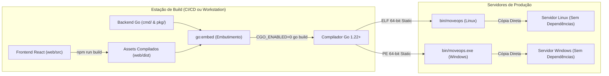

# MoveOps — Documentação Técnica Oficial v1.0.0
## 06. Guia de Implantação, Compilação e Engenharia de Release

---

### Controle do Documento
* **Projeto:** MoveOps
* **Documento Técnico:** Manual de Compilação Estática, Empacotamento e Implantação em Produção
* **Versão Homologada:** v1.0.0 Enterprise Release
* **Data:** 06 de Outubro de 2026
* **Status:** Homologado para Implantação Enterprise
* **Classificação:** Engenharia de Release, DevOps e Administração de Infraestrutura

---

## 1. Visão Geral da Arquitetura de Distribuição

O **MoveOps** foi projetado para eliminar atritos operacionais comuns em servidores de missão crítica. Graças à sua arquitetura de **Binário Único Autocontido (Single Static Binary)**:
- **Zero Dependências de Runtime:** Não requer a instalação prévia de Python, Node.js, Java, .NET Runtime ou bibliotecas dinâmicas externas de C (Glibc ou MSVCRT).
- **Interface Web Embarcada:** Os arquivos HTML, scripts empacotados, folhas de estilo e ícones da aplicação React residem internamente no executável através de `go:embed`.
- **Portabilidade Imediata:** O arquivo executável pode ser simplesmente copiado via SCP, SFTP ou pendrive para o servidor de destino e executado diretamente.



---

## 2. Pré-requisitos para Compilação a partir do Código-Fonte

> [!NOTE]
> Estes pré-requisitos aplicam-se **exclusivamente à estação de compilação (CI/CD ou máquina de desenvolvimento)**. Os servidores de produção nos quais o binário será executado **não necessitam de nenhum desses pacotes instalados**.

1. **Go Toolchain:** Versão `1.22.0` ou superior (recomendado Go `1.26+`).
2. **Node.js & NPM:** Node.js versão `18.x` ou `20.x LTS` (necessário apenas para compilar o frontend React uma única vez).
3. **Git:** Para clonagem e versionamento do repositório.

---

## 3. Passo a Passo do Processo de Compilação

### 3.1 Passo 1: Construção do Frontend React SPA
Antes de compilar o binário em Go, os artefatos do frontend devem ser transpilados e empacotados para a pasta `web/dist`:

```bash
# Navega até o diretório do frontend
cd web

# Instala as dependências do ecossistema Node (se ainda não instaladas)
npm install

# Compila o frontend gerando os assets estáticos em web/dist
npm run build

# Retorna para a raiz do projeto
cd ..
```

*Verificação:* Certifique-se de que o diretório `web/dist/` contenha o arquivo `index.html` e a pasta `assets/`.

---

### 3.2 Passo 2: Compilação Estática para Linux (x86_64 / amd64)
A compilação com `CGO_ENABLED=0` instrui o compilador Go a utilizar seu próprio resolver de rede puro em Go, dispensando qualquer dependência da biblioteca Glibc do sistema operacional hospedeiro. As flags `-ldflags="-s -w"` removem tabelas de depuração e símbolos DWARF, reduzindo drasticamente o tamanho do binário final:

```bash
# Cria o diretório de saída
mkdir -p bin

# Compilação estática para Linux 64-bit
GOOS=linux GOARCH=amd64 CGO_ENABLED=0 go build \
  -ldflags="-s -w -X 'main.AppVersion=1.0.0'" \
  -o bin/moveops \
  ./cmd/hypersync
```

---

### 3.3 Passo 3: Compilação Cruzada para Windows (x86_64 / amd64)
Uma das maiores vantagens da arquitetura Go é a capacidade de gerar executáveis nativos para Windows diretamente de uma estação Linux, sem necessidade de emuladores ou toolchains complexas:

```bash
# Compilação cruzada estática para Windows 64-bit
GOOS=windows GOARCH=amd64 CGO_ENABLED=0 go build \
  -ldflags="-s -w -X 'main.AppVersion=1.0.0'" \
  -o bin/moveops.exe \
  ./cmd/hypersync
```

---

## 4. Parâmetros e Opções de Linha de Comando (CLI)

O binário do MoveOps suporta as seguintes opções de inicialização:

| Flag de Linha de Comando | Tipo | Valor Padrão | Descrição e Finalidade Operacional |
| :--- | :---: | :---: | :--- |
| `-port` | `int` | `8080` | Define a porta TCP de escuta para o servidor HTTP e WebSockets. |
| `-audit-dir` | `string` | `./audit_logs` | Diretório onde os arquivos de eventos `.jsonl` e relatórios `.csv` serão gravados. |
| `-dir` | `string` | `""` (vazio) | Caminho para pasta externa de arquivos estáticos. Se não informado, utiliza a UI embutida no binário. |
| `-version` | `bool` | `false` | Exibe a versão oficial do sistema compilado e encerra a execução. |

### Exemplo de Teste Rápido de Versão
```bash
./bin/moveops -version
# Saída esperada: MoveOps v1.0.0
```

---

## 5. Procedimentos de Implantação em Produção

### 5.1 Implantação no Linux como Serviço do Sistema (systemd)

Para garantir que o serviço inicialize automaticamente na inicialização do servidor e seja gerenciado pelo sistema operacional, crie uma unidade de serviço systemd:

#### 1. Criação de Usuário e Pastas do Sistema
```bash
# Cria usuário de serviço sem shell interativo
sudo useradd -r -s /bin/false moveops

# Cria diretório de binários e diretório de auditoria
sudo mkdir -p /opt/moveops/bin
sudo mkdir -p /var/log/moveops/audit

# Copia o binário estático compilado
sudo cp bin/moveops /opt/moveops/bin/
sudo chmod +x /opt/moveops/bin/moveops

# Ajusta permissões
sudo chown -R moveops:moveops /opt/moveops
sudo chown -R moveops:moveops /var/log/moveops
```

#### 2. Criação do Arquivo de Serviço `/etc/systemd/system/moveops.service`
```ini
[Unit]
Description=MoveOps - Enterprise Migration Engine
After=network.target remote-fs.target
Wants=network-online.target

[Service]
Type=simple
User=moveops
Group=moveops
WorkingDirectory=/opt/moveops
ExecStart=/opt/moveops/bin/moveops -port 8080 -audit-dir /var/log/moveops/audit
Restart=on-failure
RestartSec=5s

# Limites de recursos para migração em escala
LimitNOFILE=65536
LimitNPROC=4096

# Segurança do processo no Linux
ProtectSystem=full
ProtectHome=read-only
NoNewPrivileges=true

[Install]
WantedBy=multi-user.target
```

#### 3. Ativação e Inicialização do Serviço
```bash
# Recarrega configurações do systemd
sudo systemctl daemon-reload

# Habilita inicialização automática no boot
sudo systemctl enable moveops

# Inicia o serviço
sudo systemctl start moveops

# Verifica o status da execução
sudo systemctl status moveops
```

---

### 5.2 Implantação no Windows Server como Serviço Nativo

No Windows Server, o binário estático `moveops.exe` pode ser instalado como um serviço do Windows utilizando o utilitário corporativo **NSSM (Non-Sucking Service Manager)** ou a ferramenta nativa `sc.exe`:

#### Utilizando o NSSM:
```powershell
# 1. Cria diretório de destino
New-Item -ItemType Directory -Path "C:\MoveOps\bin" -Force
New-Item -ItemType Directory -Path "C:\MoveOps\audit_logs" -Force

# 2. Copia o executável
Copy-Item ".\bin\moveops.exe" -Destination "C:\MoveOps\bin\"

# 3. Instala e configura o serviço
nssm install MoveOps "C:\MoveOps\bin\moveops.exe"
nssm set MoveOps AppParameters "-port 8080 -audit-dir C:\MoveOps\audit_logs"
nssm set MoveOps AppDirectory "C:\MoveOps"
nssm set MoveOps Start SERVICE_AUTO_START

# 4. Inicia o serviço
Start-Service MoveOps
```

---

## 6. Configuração de Rede, Firewall e Proxy Reverso

### 6.1 Liberação em Firewall de Borda e SO
O MoveOps requer apenas a liberação de sua porta de escuta TCP para acesso aos endpoints HTTP e WebSockets:
* **Linux (UFW):** `sudo ufw allow 8080/tcp comment 'MoveOps Web UI'`
* **Linux (firewalld):** `sudo firewall-cmd --permanent --add-port=8080/tcp && sudo firewall-cmd --reload`
* **Windows Defender Firewall:**
  ```powershell
  New-NetFirewallRule -DisplayName "MoveOps" -Direction Inbound -LocalPort 8080 -Protocol TCP -Action Allow
  ```

---

### 6.2 Configuração com Proxy Reverso Corporativo (Nginx com TLS/SSL)

Para ambientes de produção expostos a redes corporativas compartilhadas, recomenda-se a terminação TLS/HTTPS via Nginx, com suporte obrigatório aos cabeçalhos de *Upgrade* para WebSockets:

```nginx
server {
    listen 443 ssl http2;
    server_name moveops.corporativo.local;

    ssl_certificate     /etc/ssl/certs/moveops.crt;
    ssl_certificate_key /etc/ssl/private/moveops.key;
    ssl_protocols       TLSv1.2 TLSv1.3;
    ssl_ciphers         HIGH:!aNULL:!MD5;

    # Limite de tamanho de upload no proxy alinhado à proteção do MoveOps
    client_max_body_size 10M;

    # Rota principal para o MoveOps
    location / {
        proxy_pass http://127.0.0.1:8080;
        proxy_http_version 1.1;

        # Suporte fundamental para WebSocket persistente
        proxy_set_header Upgrade $http_upgrade;
        proxy_set_header Connection "upgrade";

        proxy_set_header Host $host;
        proxy_set_header X-Real-IP $remote_addr;
        proxy_set_header X-Forwarded-For $proxy_add_x_forwarded_for;
        proxy_set_header X-Forwarded-Proto $scheme;

        # Timeouts longos para evitar encerramento prematuro de sessões de telemetria
        proxy_read_timeout 3600s;
        proxy_send_timeout 3600s;
    }
}
```

---

## 7. Verificação e Testes Pós-Implantação (Health Check)

Após iniciar o serviço no servidor, valide seu funcionamento correto executando os seguintes testes:

1. **Teste de Conectividade HTTP:**
   ```bash
   curl -I http://localhost:8080/
   # Saída esperada: HTTP/1.1 200 OK (Content-Type: text/html)
   ```
2. **Teste da API de Descoberta de Discos:**
   ```bash
   curl -s http://localhost:8080/api/v1/disks | jq .
   # Deve retornar a lista de partições e volumes do host
   ```
3. **Acesso Visual pelo Navegador:**
   - Abra o navegador corporativo em `http://<IP-DO-SERVIDOR>:8080`.
   - O painel deve carregar com o status `ONLINE`, exibindo os cartões de seleção de origem/destino e os controles de **Produção Segura**.
