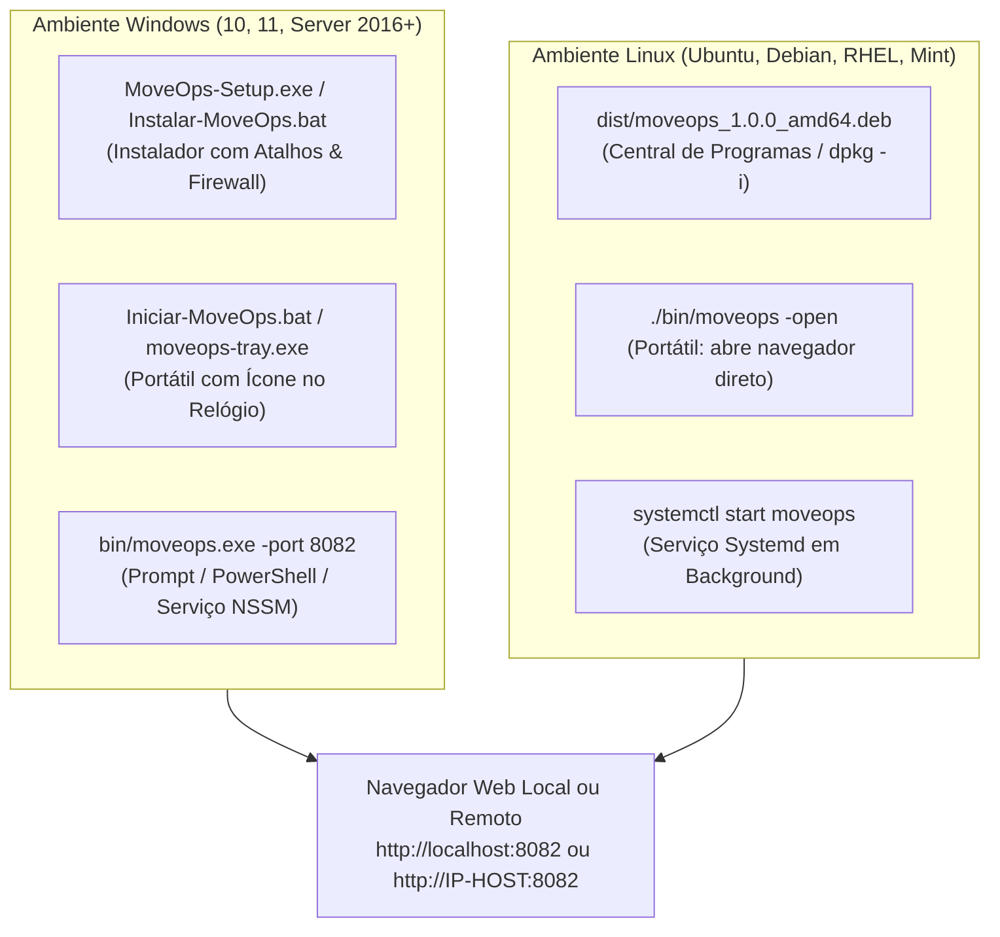

# MoveOps — Documentação Técnica Oficial v1.0.0
## 07. Guia Passo a Passo de Instalação e Testes em Novas Máquinas (Linux & Windows)

---

### Controle do Documento
* **Projeto:** MoveOps
* **Documento Técnico:** Guia Prático de Implantação Rápida e Roteiro de Homologação em Campo
* **Versão Homologada:** v1.0.0 Enterprise Release
* **Data:** 06 de Outubro de 2026
* **Status:** Homologado e Sincronizado com `COMO-INSTALAR.md`
* **Classificação:** Guia do Usuário, Manual de Operação de TI e Roteiro Hands-on

---

## 1. Visão Geral e Arquitetura Standalone

O **MoveOps** foi construído sob uma arquitetura de **Binário Único Autossuficiente (Single Static Binary)**. Isso significa que para colocar o sistema em funcionamento em qualquer servidor ou estação de trabalho — seja físico, virtual (VMware/Hyper-V/KVM) ou em nuvem (AWS/Azure/GCP) — **nenhuma instalação prévia de dependências é requerida**:
- ❌ **Não necessita** de Node.js, Python, Java, PHP ou .NET Framework.
- ❌ **Não necessita** de servidor web externo (Apache, Nginx ou IIS para funcionar na rede local).
- ❌ **Não necessita** de banco de dados externo (Oracle, PostgreSQL, MySQL ou SQL Server).
- ❌ **Não necessita** de bibliotecas dinâmicas de C (`glibc` ou `msvcrt.dll` compiladas dinamicamente).
- ✅ **A interface web SPA completa (React 18 + Tailwind CSS)** já reside compilada dentro do próprio binário executável através da tecnologia `go:embed`.

### 1.1 Ecossistema de Distribuição e Pacotes Prontos
O MoveOps disponibiliza múltiplas formas de distribuição para se adequar ao perfil do operador (usuário final, técnico de suporte ou administrador corporativo de infraestrutura):

```
migrations/
├── COMO-INSTALAR.md               # Guia rápido descomplicado na raiz
├── Instalar-MoveOps.bat           # Instalador automático para Windows (1 clique)
├── Iniciar-MoveOps.bat            # Inicializador portátil com navegador e bandeja
├── MoveOps-Setup.exe              # Instalador padrão Windows (Assistente gráfico)
├── dist/
│   └── moveops_1.0.0_amd64.deb    # Pacote Debian/Ubuntu para instalação nativa
└── bin/
    ├── moveops                    # Binário estático puro para LINUX (x86_64 / amd64)
    ├── moveops.exe                # Binário estático puro para WINDOWS (x86_64 / amd64)
    └── moveops-tray.exe           # Utilitário com ícone na bandeja do Windows (System Tray)
```



> [!NOTE]
> Por padrão, a interface do MoveOps e a API REST respondem na porta **8082** (porta configurável via parâmetro `-port`).

---

## 2. Como Instalar e Rodar no WINDOWS

### Método 1: Recomendado — Instalador em 1 Clique (Instalação Tradicional)
Ideal para estações de trabalho e servidores Windows onde se deseja atalho no Menu Iniciar e liberação automática de segurança.

1. **Localize ou baixe** o instalador:
   ```
   MoveOps-Setup.exe
   ```
   *(Ou execute com 1 clique o script `Instalar-MoveOps.bat` presente na raiz do projeto).*
2. **Execute o instalador:**
   - O assistente tradicional de instalação será exibido.
   - Clique em **"Avançar"**, **"Avançar"** e depois em **"Concluir"**.
3. **Automações executadas automaticamente pelo instalador:**
   - Cria o ícone oficial do **MoveOps** na **Área de Trabalho** e no **Menu Iniciar**.
   - Cria automaticamente a regra de liberação no **Firewall do Windows** para a porta 8082.
   - Inicia o MoveOps e abre seu navegador padrão na tela do Dashboard!

---

### Método 2: Super Rápido / Portátil (Sem Instalar Nada)
Ideal para execução a partir de pendrives, compartilhamentos de rede SMB ou testes em estações sem privilégios administrativos.

1. Na pasta do MoveOps, dê um **duplo clique** em:
   ```
   Iniciar-MoveOps.bat
   ```
   *(Ou dê duplo clique direto em `bin/moveops-tray.exe`)*.
2. O aplicativo inicializa o motor de migração e abre automaticamente o navegador padrão em:
   ```
   http://localhost:8082
   ```

---

### 🕒 Como Usar o Ícone perto do Relógio (Bandeja do Sistema / System Tray)
Quando executado via `Iniciar-MoveOps.bat` ou `moveops-tray.exe`, o MoveOps permanece ativo discretamente na bandeja do sistema (perto do relógio do Windows):

```
       +---------------------------------------------+
       | 🌐 Abrir no Navegador (Dashboard)           |
       | ------------------------------------------- |
       | 📊 Status: Ocioso / Migrando                |
       | ⏸️ Pausar / Retomar Migração                |
       | ------------------------------------------- |
       | ❌ Fechar e Sair do MoveOps                 |
       +---------------------------------------------+
                        [ Ícone MoveOps ] [ 15:30 ]
```

- **Clique com o Botão Direito** no ícone do MoveOps ao lado do relógio para:
  * Abrir a interface web a qualquer momento no navegador padrão.
  * Inspecionar o status em tempo real da transferência.
  * Pausar ou retomar a sincronização com um clique sem abrir o navegador.
  * Encerrar graciosamente o serviço.

---

### Método 3: Execução Corporativa via PowerShell / Serviço Windows (NSSM)
Para administradores que gerenciam Windows Server via PowerShell ou Remote Desktop:

#### Execução Direta via Terminal:
```powershell
cd C:\MoveOps\bin
.\moveops.exe -port 8082
```

#### Instalação como Serviço Nativo com NSSM:
```powershell
# 1. Configura diretórios
New-Item -ItemType Directory -Path "C:\MoveOps\bin" -Force
New-Item -ItemType Directory -Path "C:\MoveOps\audit_logs" -Force
Copy-Item ".\bin\moveops.exe" -Destination "C:\MoveOps\bin\"

# 2. Instala e inicia o serviço permanente
nssm install MoveOps "C:\MoveOps\bin\moveops.exe"
nssm set MoveOps AppParameters "-port 8082 -audit-dir C:\MoveOps\audit_logs"
nssm set MoveOps AppDirectory "C:\MoveOps"
nssm set MoveOps Start SERVICE_AUTO_START
Start-Service MoveOps
```

#### Liberação Manual no Firewall do Windows (se não usou o instalador):
```powershell
New-NetFirewallRule -DisplayName "MoveOps Migration Engine" `
                    -Direction Inbound `
                    -LocalPort 8082 `
                    -Protocol TCP `
                    -Action Allow `
                    -Profile Domain,Private,Public
```

---

## 3. Como Instalar e Rodar no LINUX (Ubuntu, Debian, Mint e derivados)

### Método 1: Pacote `.deb` (Padrão e Recomendado no Linux)

Se você utiliza distribuições baseadas em Debian/Ubuntu (Ubuntu Server, Ubuntu Desktop, Debian, Linux Mint, Pop!_OS):

#### Opção A: Pela Interface Gráfica (Central de Aplicativos)
1. Localize o arquivo do pacote no gerenciador de arquivos:
   ```
   dist/moveops_1.0.0_amd64.deb
   ```
2. Dê **duplo clique** sobre o arquivo `.deb`.
3. A Central de Programas do Ubuntu/GNOME Software será aberta.
4. Clique no botão **"Instalar"** e digite a sua senha de administrador.
5. O **MoveOps** aparecerá instantaneamente no seu **Menu de Aplicativos** (ícone do Dash). Basta clicar para iniciar!

#### Opção B: Pelo Terminal com 1 Comando
```bash
sudo dpkg -i dist/moveops_1.0.0_amd64.deb
```

---

### Método 2: Modo Portátil (Roda Direto sem Instalação)
Caso prefira não instalar pacotes no sistema operacional e rodar o binário standalone compilado:

1. Acesse o diretório onde o binário reside e conceda permissão de execução:
   ```bash
   chmod +x ./bin/moveops
   ```
2. Execute com a flag `-open`:
   ```bash
   ./bin/moveops -open -port 8082
   ```
3. A flag `-open` instrui o MoveOps a iniciar o servidor e **abrir imediatamente o navegador padrão da máquina** em `http://localhost:8082`.

---

### Método 3: Serviço em Segundo Plano `systemd` (Produção Contínua)
Para servidores dedicados de armazenamento onde o MoveOps deve inicializar no boot da máquina:

```bash
# 1. Cria usuário de serviço e pastas padrão
sudo useradd -r -s /bin/false moveops
sudo mkdir -p /opt/moveops/bin /var/log/moveops/audit
sudo cp ./bin/moveops /opt/moveops/bin/
sudo chmod +x /opt/moveops/bin/moveops
sudo chown -R moveops:moveops /opt/moveops /var/log/moveops

# 2. Registra o serviço no systemd
sudo bash -c 'cat <<EOF > /etc/systemd/system/moveops.service
[Unit]
Description=MoveOps - Enterprise Migration Engine
After=network.target remote-fs.target
Wants=network-online.target

[Service]
Type=simple
User=moveops
Group=moveops
WorkingDirectory=/opt/moveops
ExecStart=/opt/moveops/bin/moveops -port 8082 -audit-dir /var/log/moveops/audit
Restart=on-failure
RestartSec=5s
LimitNOFILE=65536

[Install]
WantedBy=multi-user.target
EOF'

# 3. Ativa e inicializa o serviço
sudo systemctl daemon-reload
sudo systemctl enable --now moveops

# 4. Verifica o status do serviço
sudo systemctl status moveops
```

#### Liberação de Firewall no Linux (Porta 8082):
* **Ubuntu / Debian com UFW:** `sudo ufw allow 8082/tcp comment 'MoveOps Web UI'`
* **RHEL / Rocky / CentOS com firewalld:** `sudo firewall-cmd --permanent --add-port=8082/tcp && sudo firewall-cmd --reload`

---

## 4. Como Acessar o MoveOps a partir de Outro Computador na Rede

Se o MoveOps estiver rodando em um servidor ou computador central e você quiser acessá-lo do seu notebook de trabalho:

### 1. Descubra o IP do Computador Hospedeiro
* **No Windows:** Abra o Prompt de Comando (CMD) e digite `ipconfig`. Localize o *Endereço IPv4* (ex: `192.168.1.50`).
* **No Linux:** Abra o terminal e digite `hostname -I`. O primeiro IP da lista é o endereço da máquina (ex: `192.168.1.50`).

### 2. No Navegador do Outro Computador
Abra o navegador e digite o IP seguido de `:8082`:
```
http://192.168.1.50:8082
```

> [!TIP]
> Lembre-se de certificar-se de que os dois computadores estejam na mesma rede local (ou conectados pela mesma VPN corporativa).

---

## 5. Roteiro Prático de Teste de Migração em 5 Passos (Hands-on)

Para homologar a ferramenta e atestar o funcionamento do controle de **Produção Segura**, execute o seguinte roteiro guiado de validação prática:

### Passo 1: Criar Pastas e Arquivos de Simulação

No servidor onde o MoveOps está rodando, crie rapidamente uma pasta de origem com alguns arquivos e uma pasta de destino vazia:

* **No Linux:**
  ```bash
  mkdir -p /tmp/moveops_origem/projetos /tmp/moveops_origem/documentos /tmp/moveops_destino

  # Gera arquivos de teste com diferentes tamanhos
  echo "Conteudo confidencial contrato 2026" > /tmp/moveops_origem/documentos/contrato.txt
  echo "Dados de telemetria analitica" > /tmp/moveops_origem/projetos/telemetria.log
  dd if=/dev/urandom of=/tmp/moveops_origem/projetos/dataset_10mb.dat bs=1M count=10 2>/dev/null
  dd if=/dev/urandom of=/tmp/moveops_origem/projetos/dataset_50mb.dat bs=1M count=50 2>/dev/null
  ```

* **No Windows (PowerShell):**
  ```powershell
  New-Item -ItemType Directory -Path "C:\temp\moveops_origem\documentos" -Force
  New-Item -ItemType Directory -Path "C:\temp\moveops_origem\projetos" -Force
  New-Item -ItemType Directory -Path "C:\temp\moveops_destino" -Force

  Set-Content -Path "C:\temp\moveops_origem\documentos\contrato.txt" -Value "Conteudo confidencial 2026"
  Set-Content -Path "C:\temp\moveops_origem\projetos\telemetria.log" -Value "Dados de telemetria"
  
  # Cria arquivo de teste de 20MB
  $bytes = New-Object Byte[] (20 * 1024 * 1024)
  [System.IO.File]::WriteAllBytes("C:\temp\moveops_origem\projetos\dataset_20mb.dat", $bytes)
  ```

---

### Passo 2: Acessar a Interface e Inspecionar o Armazenamento
1. Abra o navegador em `http://<IP-DO-HOST>:8082`.
2. Observe no cabeçalho superior o logotipo oficial `logo-n-fundo.png`, o badge animado **OCIOSO (IDLE)** e o indicador **LIVE WebSocket**.
3. Clique na **Aba 2: Armazenamento**:
   - Observe a lista de todos os discos físicos, partições e unidades do sistema detectadas automaticamente.
   - Veja as métricas de capacidade total, espaço livre e a identificação do tipo de disco (SSD/NVMe vs HDD mecânico).

---

### Passo 3: Configurar a Migração na Aba 3 (Nova Migração)
1. Clique na **Aba 3: Nova Migração**.
2. No campo **Diretório de Origem**:
   - Digite `/tmp/moveops_origem` (no Linux) ou `C:\temp\moveops_origem` (no Windows), ou clique no botão **Navegar** para usar o explorador de pastas embutido.
3. No campo **Diretório de Destino**:
   - Digite `/tmp/moveops_destino` (no Linux) ou `C:\temp\moveops_destino` (no Windows).
4. No modo de sincronização, selecione **Migração Completa (Full Migration)**.
5. No bloco de **Controle de Throttling (Produção Segura)**:
   - Observe que o preset **Produção Padrão (50 MB/s • 300 IOPS • 4 Workers)** já vem ativado por padrão.
   - Se desejar, clique no preset **Horário Comercial (25 MB/s • 150 IOPS • 2 Workers)** para testar a carga ultraleve.

---

### Passo 4: Executar a Estimativa Prévia (Dry Run Preview)
1. Clique no botão **Estimar / Pré-visualizar (Dry Run)** na parte inferior.
2. O sistema executará uma varredura ultra-rápida sem copiar nenhum dado físico e abrirá um modal exibindo:
   - Contagem de arquivos encontrados;
   - Volume total em Megabytes/Gigabytes;
   - Tempo estimado de conclusão (ETA) calculado com base na velocidade de throttling escolhida.
3. Verifique os dados e clique em **Iniciar Migração** diretamente no modal.

---

### Passo 5: Acompanhar na Aba 4 (Telemetria) e Validar na Aba 5 (Auditoria)
1. A interface mudará instantaneamente para a **Aba 4: Telemetria & Ao Vivo**:
   - O badge no topo passará para **EM EXECUÇÃO** com pulso verde e exibirá `Fase 1: Baseline`.
   - Veja o gráfico dinâmico **Sparkline** registrando a oscilação da velocidade.
   - Veja os cartões indicando a velocidade instantânea (MB/s), o IOPS corrente, a porcentagem e o tempo decorrido.
   - Teste o **Hot Reloading:** Altere o campo de velocidade para `80 MB/s` e clique em **Atualizar Limites** — a velocidade responde em milissegundos sem pausar a transferência!
   - No terminal **Live Feed Console**, observe cada arquivo sendo finalizado em streaming com seu caminho e soma de verificação matemática `xxHash64`.
2. Ao concluir a transferência, o status mudará para **CONCLUÍDO (Ciano)**.
3. Clique na **Aba 5: Auditoria & Relatórios**:
   - Veja a tabela consolidada do job com 100% de integridade e zero erros.
   - Clique em **Exportar Relatório CSV** ou **Baixar Eventos JSONL** para descarregar a trilha de conformidade forense para o seu computador.
4. **Verificação física no disco:**
   - Liste a pasta `/tmp/moveops_destino` (ou `C:\temp\moveops_destino`) no servidor e certifique-se de que toda a estrutura de subpastas e arquivos foi replicada com perfeição.

---

## 6. Resolução de Problemas (Troubleshooting) e Perguntas Frequentes (FAQ)

### 6.1 A página não carregou ("Conexão Recusada" ou "Não é possível acessar esse site")
1. Verifique se o processo do MoveOps está em execução (verifique o ícone ao lado do relógio no Windows ou execute `ps aux | grep moveops` no Linux).
2. Se estiver acessando de outro computador, verifique se a porta 8082 foi liberada no firewall do servidor (conforme as Seções 2.3 ou 3.3).
3. Teste a conectividade local rápida com `curl`:
   ```bash
   curl -I http://localhost:8082/
   # Saída esperada: HTTP/1.1 200 OK
   ```

---

### 6.2 A porta 8082 já está sendo usada por outro serviço
Basta alterar a porta de escuta informando o parâmetro `-port`:
```bash
# Executa na porta 8090 no Linux
./bin/moveops -port 8090 -open
```
No Windows:
```powershell
.\bin\moveops.exe -port 8090
```
Em seguida, acesse no navegador: `http://localhost:8090`.

---

### 6.3 Como pausar ou fechar o MoveOps?
- **Pausar temporariamente:** Clique no botão **"Pausar"** na Aba 4 (Telemetria) do navegador, ou clique com o botão direito no ícone do relógio do Windows e selecione **"Pausar / Retomar"**.
- **Fechar e encerrar:** Pressione `Ctrl + C` no terminal onde ele está rodando, ou clique com o botão direito no ícone do relógio e escolha **"Fechar e Sair"**, ou no Linux execute `sudo systemctl stop moveops` / `pkill -f moveops`.

---

## 7. Tabela Resumo de Comandos Rápidos

| Ação Operacional | Comando no Linux | Comando no Windows |
| :--- | :--- | :--- |
| **Verificar Versão** | `./bin/moveops -version` | `.\bin\moveops.exe -version` |
| **Executar e Abrir Navegador** | `./bin/moveops -open` | `.\Iniciar-MoveOps.bat` |
| **Executar na Porta 8082** | `./bin/moveops -port 8082` | `.\bin\moveops.exe -port 8082` |
| **Instalação em 1 Clique** | `sudo dpkg -i dist/moveops_1.0.0_amd64.deb` | `.\Instalar-MoveOps.bat` ou `MoveOps-Setup.exe` |
| **Parar Processo** | `Ctrl + C` ou `pkill -f moveops` | `Ctrl + C` ou Botão Direito no Ícone do Relógio |
