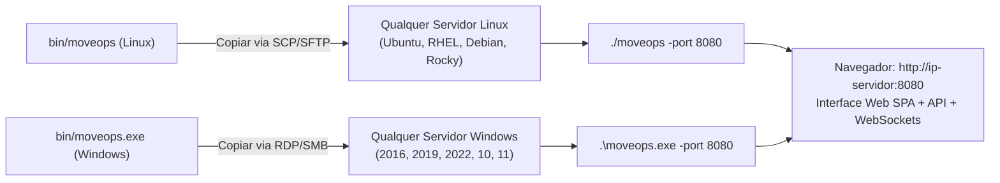

# MoveOps — Documentação Técnica Oficial v1.0.0
## 07. Guia Passo a Passo de Instalação e Testes em Novas Máquinas (Linux & Windows)

---

### Controle do Documento
* **Projeto:** MoveOps
* **Documento Técnico:** Guia Prático de Implantação Rápida e Roteiro de Homologação em Campo
* **Versão Homologada:** v1.0.0 Enterprise Release
* **Data:** 06 de Outubro de 2026
* **Status:** Homologado e Pronto para Uso
* **Classificação:** Guia do Usuário, Manual de Operação de TI e Roteiro Hands-on

---

## 1. Visão Geral e Arquitetura Standalone

O **MoveOps** foi construído sob uma arquitetura de **Binário Único Autossuficiente (Single Static Binary)**. Isso significa que para colocar o sistema em funcionamento em qualquer servidor — seja físico, virtual (VMware/Hyper-V/KVM) ou em nuvem (AWS/Azure/GCP) — **nenhuma instalação prévia de dependências é requerida**:
- ❌ **Não necessita** de Node.js, Python, Java, PHP ou .NET Framework.
- ❌ **Não necessita** de servidor web externo (Apache, Nginx ou IIS para funcionar na rede local).
- ❌ **Não necessita** de banco de dados externo (Oracle, PostgreSQL, MySQL ou SQL Server).
- ❌ **Não necessita** de bibliotecas dinâmicas de C (`glibc` ou `msvcrt.dll` compiladas dinamicamente).
- ✅ **A interface web SPA completa (React 18 + Tailwind CSS)** já reside compilada dentro do próprio binário executável através da tecnologia `go:embed`.

### 1.1 Localização dos Executáveis Prontos no Repositório
No diretório `bin/` do projeto, os executáveis prontos para uso em produção já se encontram compilados:

```
migrations/
└── bin/
    ├── moveops        # Executável estático para servidores LINUX (x86_64 / amd64)
    └── moveops.exe    # Executável estático para servidores WINDOWS (x86_64 / amd64)
```



> [!NOTE]
> Os binários podem ser copiados livremente para quantos servidores forem necessários na infraestrutura, sem restrições de licenças de biblioteca ou acoplamento com o ambiente de build.

---

## 2. Passo a Passo Completo para Servidores LINUX

Este procedimento destina-se a distribuições Linux empresariais de 64 bits (Ubuntu Server 20.04/22.04/24.04, Debian 11/12, RHEL/CentOS/Rocky Linux/AlmaLinux 8/9, SUSE Linux Enterprise).

### 2.1 Passo 1: Transferir o Binário para o Servidor de Destino
A partir da sua estação de trabalho, envie o binário `bin/moveops` para o servidor remoto utilizando `scp` ou `rsync`:

```bash
# Exemplo via SCP (substitua o usuário e o IP pelo seu servidor)
scp bin/moveops administrador@192.168.1.50:/home/administrador/

# Ou via Rsync com barra de progresso
rsync -avzP bin/moveops administrador@192.168.1.50:/home/administrador/
```

---

### 2.2 Passo 2: Conectar ao Servidor e Conceder Permissão de Execução
Conecte-se via SSH ao servidor e adicione permissão de execução ao arquivo:

```bash
# Conexão SSH
ssh administrador@192.168.1.50

# Concede permissão de execução
chmod +x ./moveops

# Valida a integridade e versão do executável
./moveops -version
# Saída esperada: MoveOps v1.0.0
```

---

### 2.3 Passo 3: Executar o MoveOps

Você pode executar o MoveOps de três formas diferentes, dependendo do objetivo:

#### Opção A: Execução Interativa Direta (Ideal para testes rápidos e demonstrações)
Execute o comando no terminal. Os logs de acesso e telemetria serão exibidos diretamente na tela:
```bash
./moveops -port 8080
```
*Para encerrar:* Pressione `Ctrl + C` a qualquer momento (o motor encerra graciosamente em menos de 1 segundo).

#### Opção B: Execução em Segundo Plano com `nohup` (Simples e desacoplado da sessão SSH)
Permite que o MoveOps continue rodando mesmo após você fechar a janela do terminal SSH:
```bash
# Cria diretório para logs de auditoria
mkdir -p ./audit_logs

# Inicia em background gravando log em moveops.log
nohup ./moveops -port 8080 -audit-dir ./audit_logs > moveops.log 2>&1 &

# Verifica se o processo está em execução
ps aux | grep moveops

# Acompanha os logs em tempo real
tail -f moveops.log
```
*Para parar o processo nohup:*
```bash
pkill -f moveops
```

#### Opção C: Execução como Serviço de Sistema `systemd` (Recomendado para Produção)
Garante reinicialização automática caso o servidor seja reiniciado:

```bash
# 1. Cria usuário dedicado e diretórios
sudo useradd -r -s /bin/false moveops
sudo mkdir -p /opt/moveops/bin /var/log/moveops/audit

# 2. Copia o binário para o diretório padrão
sudo cp ./moveops /opt/moveops/bin/
sudo chmod +x /opt/moveops/bin/moveops
sudo chown -R moveops:moveops /opt/moveops /var/log/moveops

# 3. Cria a unidade systemd
sudo bash -c 'cat <<EOF > /etc/systemd/system/moveops.service
[Unit]
Description=MoveOps - Enterprise Migration Engine
After=network.target remote-fs.target
Wants=network-online.target

[Service]
Type=simple
User=moveops
Group=moveops
WorkingDirectory=/opt/moveops
ExecStart=/opt/moveops/bin/moveops -port 8080 -audit-dir /var/log/moveops/audit
Restart=on-failure
RestartSec=5s
LimitNOFILE=65536

[Install]
WantedBy=multi-user.target
EOF'

# 4. Ativa e inicializa o serviço
sudo systemctl daemon-reload
sudo systemctl enable --now moveops

# 5. Verifica o status do serviço
sudo systemctl status moveops
```

---

### 2.4 Passo 4: Liberar a Porta no Firewall do Linux
Caso o servidor possua firewall ativo, libere a porta TCP 8080:

* **Em servidores com UFW (Ubuntu/Debian):**
  ```bash
  sudo ufw allow 8080/tcp comment 'MoveOps Web UI e WebSocket'
  sudo ufw reload
  ```

* **Em servidores com firewalld (RHEL/CentOS/Rocky/AlmaLinux):**
  ```bash
  sudo firewall-cmd --permanent --add-port=8080/tcp
  sudo firewall-cmd --reload
  ```

* **Em servidores com iptables:**
  ```bash
  sudo iptables -A INPUT -p tcp --dport 8080 -j ACCEPT
  ```

---

### 2.5 Passo 5: Acessar a Interface Web
Abra o navegador em sua estação de trabalho e acesse:
```
http://<IP-DO-SERVIDOR-LINUX>:8080
```
Exemplo: `http://192.168.1.50:8080`

---

## 3. Passo a Passo Completo para Servidores WINDOWS

Este procedimento destina-se a servidores Windows Server 2016, 2019, 2022 ou estações Windows 10 e 11 Pro de 64 bits.

### 3.1 Passo 1: Transferir o Binário para o Servidor Windows
Você pode copiar o arquivo `bin/moveops.exe` para o servidor utilizando qualquer um dos métodos usuais:
- **Área de Trabalho Remota (RDP):** Copie o arquivo na sua máquina (`Ctrl + C`) e cole diretamente na área de trabalho ou em `C:\MoveOps\` no servidor remoto.
- **Compartilhamento de Rede SMB:** Copie para `\\192.168.1.60\c$\MoveOps\moveops.exe`.
- **PowerShell Remoto / WinSCP:** Transfira para a pasta `C:\MoveOps\`.

Recomenda-se criar a seguinte estrutura de pastas no Windows:
```powershell
New-Item -ItemType Directory -Path "C:\MoveOps\bin" -Force
New-Item -ItemType Directory -Path "C:\MoveOps\audit_logs" -Force
Copy-Item ".\bin\moveops.exe" -Destination "C:\MoveOps\bin\"
```

---

### 3.2 Passo 2: Executar o MoveOps no Windows

#### Opção A: Execução Interativa via PowerShell ou Prompt de Comando (CMD)
Abra o **PowerShell** ou **Prompt de Comando** como Administrador e execute:

```powershell
cd C:\MoveOps\bin
.\moveops.exe -port 8080
```
O console exibirá as mensagens de inicialização do motor e da interface web.  
*Para encerrar:* Pressione `Ctrl + C` no terminal.

#### Opção B: Execução via Duplo Clique
Se preferir, crie um atalho na Área de Trabalho ou dê duplo clique em `moveops.exe`. Uma janela de console se abrirá mantendo o servidor ativo.

#### Opção C: Instalação como Serviço do Windows com NSSM (Produção Contínua)
Para que o MoveOps execute permanentemente como um serviço de segundo plano que inicializa antes mesmo do login do usuário:

1. Baixe o utilitário leve [NSSM (Non-Sucking Service Manager)](https://nssm.cc/download).
2. Abra o PowerShell como Administrador e execute:
```powershell
# Instala o serviço MoveOps
nssm install MoveOps "C:\MoveOps\bin\moveops.exe"
nssm set MoveOps AppParameters "-port 8080 -audit-dir C:\MoveOps\audit_logs"
nssm set MoveOps AppDirectory "C:\MoveOps"
nssm set MoveOps Start SERVICE_AUTO_START

# Inicia o serviço
Start-Service MoveOps

# Verifica se está rodando
Get-Service MoveOps
```

---

### 3.3 Passo 3: Liberar a Porta no Firewall do Windows
No PowerShell com privilégios de Administrador, crie a regra de entrada no Firewall do Windows:

```powershell
New-NetFirewallRule -DisplayName "MoveOps Migration Engine" `
                    -Direction Inbound `
                    -LocalPort 8080 `
                    -Protocol TCP `
                    -Action Allow `
                    -Profile Domain,Private,Public
```

---

### 3.4 Passo 4: Acessar a Interface Web
Abra o navegador em sua estação corporativa e acesse:
```
http://<IP-DO-SERVIDOR-WINDOWS>:8080
```
Exemplo: `http://192.168.1.60:8080`

---

## 4. Roteiro Prático de Teste de Migração em 5 Passos (Hands-on)

Para homologar a ferramenta e atestar o funcionamento do controle de **Produção Segura**, execute o seguinte roteiro guiado de validação prática:

### Passo 1: Criar Pastas e Arquivos de Simulação

No servidor onde o MoveOps está rodando, crie rapidamente uma pasta de origem com alguns arquivos e uma pasta de destino vazia:

* **No Linux:**
  ```bash
  mkdir -p /tmp/moveops_origem/projetos /tmp/moveops_origem/documentos /tmp/moveops_destino

  # Gera arquivos de teste com diferentes tamanhos
  echo "Conteudo confidencial contrato 2026" > /tmp/moveops_origem/documentos/contrato.txt
  echo "Dados de telemetria analitica" > /tmp/moveops_origem/projetos/telemetria.log
  dd if=/dev/urandom of=/tmp/moveops_origem/projetos/dataset_10mb.dat bs=1M count=10 2>/dev/null
  dd if=/dev/urandom of=/tmp/moveops_origem/projetos/dataset_50mb.dat bs=1M count=50 2>/dev/null
  ```

* **No Windows (PowerShell):**
  ```powershell
  New-Item -ItemType Directory -Path "C:\temp\moveops_origem\documentos" -Force
  New-Item -ItemType Directory -Path "C:\temp\moveops_origem\projetos" -Force
  New-Item -ItemType Directory -Path "C:\temp\moveops_destino" -Force

  Set-Content -Path "C:\temp\moveops_origem\documentos\contrato.txt" -Value "Conteudo confidencial 2026"
  Set-Content -Path "C:\temp\moveops_origem\projetos\telemetria.log" -Value "Dados de telemetria"
  
  # Cria arquivo de teste de 20MB
  $bytes = New-Object Byte[] (20 * 1024 * 1024)
  [System.IO.File]::WriteAllBytes("C:\temp\moveops_origem\projetos\dataset_20mb.dat", $bytes)
  ```

---

### Passo 2: Acessar a Interface e Inspecionar o Armazenamento
1. Abra o navegador em `http://<IP-DO-HOST>:8080`.
2. Observe no cabeçalho o badge animado **OCIOSO (IDLE)** e o indicador **LIVE WebSocket**.
3. Clique na **Aba 2: Armazenamento**:
   - Observe a lista de todos os discos físicos, partições e unidades do sistema detectadas automaticamente.
   - Veja as métricas de capacidade total, espaço livre e a identificação do tipo de disco (SSD/NVMe vs HDD mecânico).

---

### Passo 3: Configurar a Migração na Aba 3 (Nova Migração)
1. Clique na **Aba 3: Nova Migração**.
2. No campo **Diretório de Origem**:
   - Digite `/tmp/moveops_origem` (no Linux) ou `C:\temp\moveops_origem` (no Windows), ou clique em **Navegar** para usar o explorador de pastas embutido.
3. No campo **Diretório de Destino**:
   - Digite `/tmp/moveops_destino` (no Linux) ou `C:\temp\moveops_destino` (no Windows).
4. No modo de sincronização, selecione **Migração Completa (Full Migration)**.
5. No bloco de **Controle de Throttling (Produção Segura)**:
   - Observe que o preset **Produção Padrão (50 MB/s • 300 IOPS • 4 Workers)** já vem ativado por padrão.
   - Se desejar, clique no preset **Horário Comercial (25 MB/s • 150 IOPS • 2 Workers)** para testar a carga ultraleve.

---

### Passo 4: Executar a Estimativa Prévia (Dry Run Preview)
1. Clique no botão cinza **Estimar / Pré-visualizar (Dry Run)** na parte inferior.
2. O sistema executará uma varredura ultra-rápida sem copiar nenhum dado físico e abrirá um modal exibindo:
   - Contagem de arquivos encontrados;
   - Volume total em Megabytes/Gigabytes;
   - Tempo estimado de conclusão (ETA) calculado com base na velocidade de throttling escolhida.
3. Verifique os dados e clique em **Iniciar Migração** diretamente no modal (ou feche e clique no botão azul na página).

---

### Passo 5: Acompanhar na Aba 4 (Telemetria) e Validar na Aba 5 (Auditoria)
1. A interface mudará instantaneamente para a **Aba 4: Telemetria & Ao Vivo**:
   - O badge no topo passará para **EM EXECUÇÃO** com pulso verde e exibirá `Fase 1: Baseline`.
   - Veja o gráfico dinâmico **Sparkline** registrando a oscilação da velocidade.
   - Veja os cartões indicando a velocidade instantânea (MB/s), o IOPS corrente, a porcentagem e o tempo decorrido.
   - Teste o **Hot Reloading:** Altere o campo de velocidade para `80 MB/s` e clique em **Atualizar Limites** — veja a velocidade responder em milissegundos sem pausar a transferência!
   - No terminal **Live Feed Console**, observe cada arquivo sendo finalizado em streaming com seu caminho e soma de verificação `xxHash64`.
2. Ao concluir a transferência, o status mudará para **CONCLUÍDO (Ciano)**.
3. Clique na **Aba 5: Auditoria & Relatórios**:
   - Veja a tabela consolidada do job com 100% de integridade e zero erros.
   - Clique em **Exportar Relatório CSV** ou **Baixar Eventos JSONL** para descarregar a trilha de conformidade forense para o seu computador.
4. **Verificação física no disco:**
   - Liste a pasta `/tmp/moveops_destino` (ou `C:\temp\moveops_destino`) no servidor e certifique-se de que toda a estrutura de subpastas e arquivos foi replicada com perfeição.

---

## 5. Resolução de Problemas (Troubleshooting) e Perguntas Frequentes (FAQ)

### 5.1 A porta 8080 já está em uso por outro serviço (ex: Tomcat, Jenkins ou proxy)
Se ao iniciar você receber o erro `bind: address already in use`, basta alterar a porta de escuta através da flag `-port`:

```bash
# Executa na porta 8090 ou 9000
./moveops -port 8090
```
No Windows:
```powershell
.\moveops.exe -port 8090
```
Em seguida, acesse pelo navegador em `http://<IP-DO-SERVIDOR>:8090`.

---

### 5.2 Não consigo acessar a interface pelo navegador de outra máquina
Se o navegador indicar *"Não é possível acessar esse site"* ou *"Conexão recusada"*:
1. **Verifique se o processo está escutando na máquina local:**
   - No Linux: `curl -I http://localhost:8080/` (deve retornar `HTTP/1.1 200 OK`).
   - No Windows (PowerShell): `Invoke-WebRequest -Uri http://localhost:8080/`
2. **Verifique o Firewall do sistema operacional:**
   - Certifique-se de ter aplicado a regra de liberação TCP 8080 indicada nas Seções 2.4 (Linux) ou 3.3 (Windows).
3. **Verifique se há Security Groups ou firewalls de rede intermediários:**
   - Em instâncias de nuvem (AWS EC2, Azure VM, GCP Compute Engine), garanta que o grupo de segurança permita tráfego de entrada na porta TCP 8080 a partir do seu endereço IP.

---

### 5.3 Como verificar os logs e diagnósticos do MoveOps?
- **Se executado via `nohup` no Linux:** Consulte o arquivo de log com `tail -n 100 moveops.log`.
- **Se executado via `systemd` no Linux:** Use `journalctl -u moveops -f -n 50`.
- **Se executado no Windows:** Os logs aparecem diretamente na janela do console ou, se configurado via NSSM, em `C:\MoveOps\audit_logs\`.

---

### 5.4 Teste rápido de saúde via linha de comando (Health Check API)
Você pode atestar se a engine está saudável através de chamadas simples com `curl`:

```bash
# 1. Verifica resposta do servidor HTTP
curl -s -o /dev/null -w "%{http_code}\n" http://localhost:8080/
# Saída esperada: 200

# 2. Testa a API de Descoberta de Discos
curl -s http://localhost:8080/api/v1/disks | jq .

# 3. Consulta o status da migração atual
curl -s http://localhost:8080/api/v1/migration/status | jq .
```

---

## 6. Resumo dos Comandos Úteis

| Ação Operacional | Comando no Linux | Comando no Windows |
| :--- | :--- | :--- |
| **Verificar Versão** | `./moveops -version` | `.\moveops.exe -version` |
| **Execução Simples** | `./moveops -port 8080` | `.\moveops.exe -port 8080` |
| **Execução em Porta Customizada** | `./moveops -port 9090` | `.\moveops.exe -port 9090` |
| **Execução com Pasta de Logs Customizada** | `./moveops -audit-dir /var/log/migracoes` | `.\moveops.exe -audit-dir D:\Logs` |
| **Parar Processo** | `Ctrl + C` ou `pkill -f moveops` | `Ctrl + C` ou Fechar Janela do Prompt |
